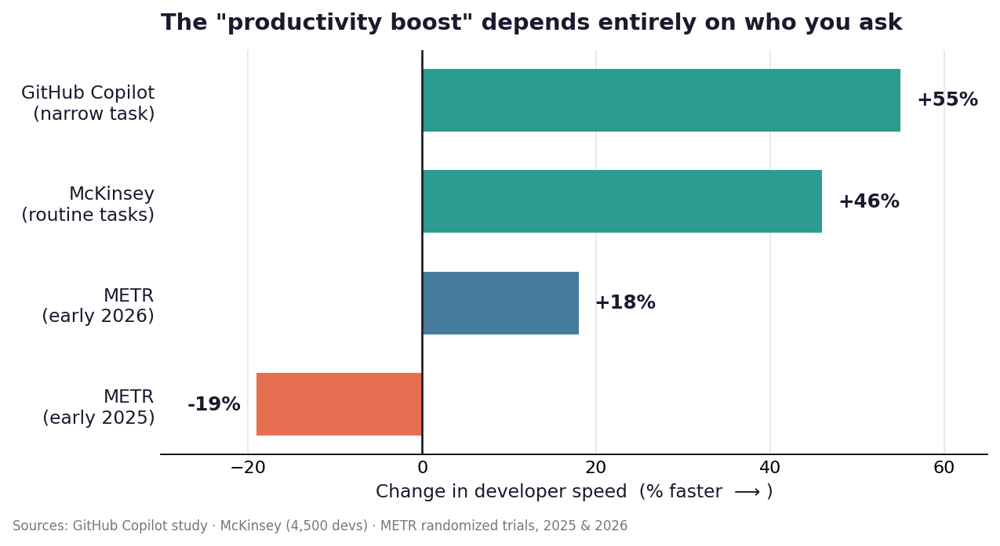
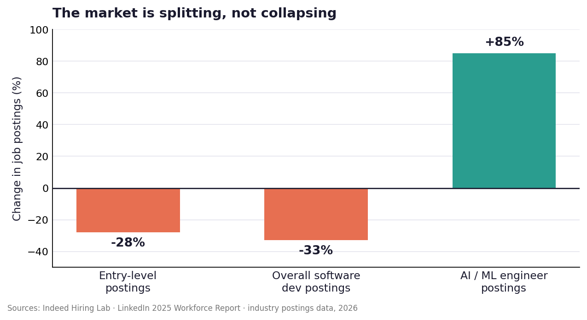

# Can AI Replace Human Programmers?

### A balanced look at the hype, the data, and the reality — 2026

> **The short answer:** AI is already rewriting *how* code gets written, but the evidence says it's reshaping the job, not erasing it.

---

## Slide 1 — The Bold Claims

The people building these tools have made dramatic predictions:

- **Dario Amodei (Anthropic CEO), March 2025:** AI would write *"90% of the code"* within 3–6 months, and *"essentially all of the code"* within 12 months.
- **Mark Zuckerberg & Satya Nadella:** talked publicly about AI doing the work of mid-level engineers; Nadella said 20–30% of code in some Microsoft projects is now AI-generated. Google reported 25%+ of its new code is AI-generated.
- **Salesforce:** CEO Marc Benioff said the company hired **zero new engineers** in fiscal 2026, crediting AI coding tools.

And adoption is real, not hypothetical:

- **92.6%** of developers use an AI coding assistant at least monthly (Stack Overflow 2025 survey, ~49,000 respondents).
- GitHub Copilot has ~20M users; Cursor hit **$2B in annual revenue** by February 2026.

---

## Slide 2 — Reality Check: Productivity Is Messy

The same question — *"does AI make developers faster?"* — gets wildly different answers:

- A **GitHub** study showed **+55% faster**… on a single narrow task (writing an HTTP server).
- **McKinsey** (4,500 developers) found **46% less time** on *routine* tasks like boilerplate and tests.
- But **METR's** randomized trial of experienced open-source developers found they were **19% *slower*** with AI in early 2025 — even though they *felt* 20% faster. A 2026 follow-up flipped to **+18%** as the same developers learned the tools.

The catch — quality:

- Only **29%** of developers trust AI output, **down from 40%** in 2024.
- CodeRabbit (Dec 2025) found **~1.7× more issues** in AI-coauthored pull requests.
- Code "churn" (code rewritten within two weeks) roughly **doubled**, from ~3.3% to 5.7–7.1% (GitClear, 211M lines analyzed).

---

## Slide 3 — What AI Still Can't Do

Even the optimists admit there are limits. Amodei himself said the programmer still has to decide *what to build, how it fits the larger system, and whether the design is secure.*

AI assistants reliably struggle with:

- **System design & architecture** — trade-offs across cost, security, and scale.
- **Understanding large, unfamiliar codebases** and legacy systems outside their training data.
- **Debugging subtle, novel problems** rather than common patterns.
- **Production judgment** — the last-minute call during an outage, knowing *why* a choice matters.

> The recurring industry verdict: AI is a powerful **assistant that still needs an experienced human to validate it**, not an autonomous replacement.

---

## Slide 4 — The Job Market: Splitting, Not Collapsing

The labor data shows a **restructuring**, not a wipeout:

- **Entry-level** developer postings are down ~28% from their 2022 peak; overall software postings sit ~33% below the 2020 baseline.
- But **AI/ML engineering** roles are up ~85% year-over-year, and **senior/staff** roles are growing — AI *amplifies* experienced engineers.
- The U.S. Bureau of Labor Statistics still projects **~15% growth** for software developers through 2034.

The real risks are subtler:

- A **"cut-and-redirect"** pattern — companies lay off, then re-hire into AI-focused roles.
- A looming **pipeline problem**: cutting junior roles today means fewer experienced mid-level engineers in 2027–2029, because juniors are how the next seniors are made.

---

## Slide 5 — The Verdict

**Can AI replace human programmers? Not today — and the bold 12-month predictions did not come true.**

What's actually happening:

| The hype said | The evidence shows |
|---|---|
| AI writes ~all the code | AI accelerates *parts* of coding; humans still own design, review, and judgment |
| Developers become obsolete | The role is shifting from *writing* code to *directing and verifying* it |
| Mass replacement | Market restructuring — fewer juniors, more AI-adjacent and senior roles |

**Takeaway:** The developer who gets replaced isn't replaced by AI — they're replaced by *a developer who knows how to use AI well.*

---

## Sources

1. Stack Overflow 2025 Developer Survey — adoption & trust figures.
2. McKinsey developer productivity survey (4,500 developers) — routine-task time savings.
3. METR randomized controlled trials (2025 & 2026) — real-world developer speed. https://metr.org/blog/2025-07-10-early-2025-ai-experienced-os-dev/
4. GitHub Copilot productivity study — narrow-task speedup.
5. CodeRabbit (Dec 2025) — defect rates in AI-coauthored PRs.
6. GitClear — code churn analysis (211M lines, 2020–2024).
7. Dario Amodei, Council on Foreign Relations (March 10, 2025) — "90% of code" prediction. (Entrepreneur, IT Pro coverage.)
8. Satya Nadella / Sundar Pichai — AI-generated code share at Microsoft & Google.
9. Salesforce / Marc Benioff (CNBC, Sept 2025) — zero engineering hires in FY2026.
10. Indeed Hiring Lab & LinkedIn 2025 Workforce Report — job-posting trends.
11. U.S. Bureau of Labor Statistics — software developer employment projections (2024–2034).
12. IEEE Spectrum (Feb 2026), MIT Technology Review (Dec 2025) — entry-level market & "is it real?" analysis.
