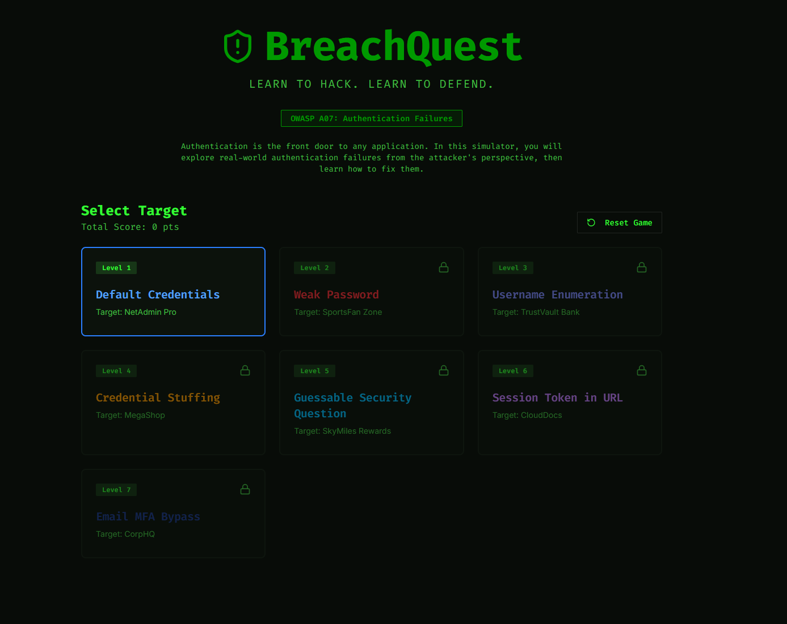
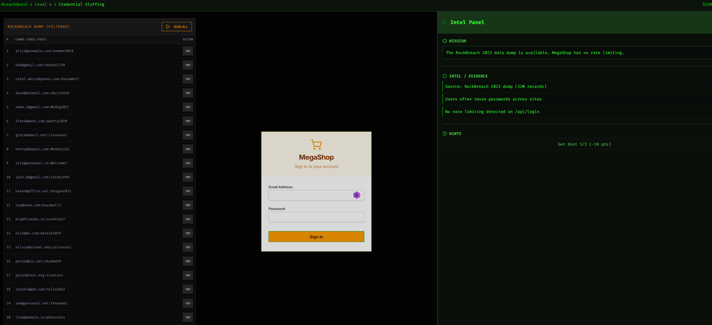

# Vibe Coding Assignment 1: Authentication Failures (A07:2025)

## 1. Overview: Vibe Coding Tool

For this assignment I used **Replit** with its built-in AI Agent.

I picked Replit for a few reasons:

- **Free to start.** The free tier gives enough monthly Agent credits to build and run a small game without a credit card.
- **All-in-one.** It handles the code editor, the runtime, package install, and public hosting (a `.replit.app` URL) in one place. I didn't have to deploy anywhere — I described what I wanted in plain English and the Agent produced a running game.
- **Good fit for backend logic.** A hacker simulator needs real server-side login code with real (intentional) flaws — not just a frontend mockup. Replit handles full-stack scenarios more naturally than others.
- **Class familiarity.** The provided SQL injection demo also used Replit, so I could compare my workflow to that example.

## 2. Description of the Program

I built **BreachQuest** — a level-based hacker simulator game where the player is a (fictional) penetration tester trying to break into accounts on a series of increasingly secure login portals. Each level exploits a different authentication failure from OWASP A07. When the player breaks in, the game shows them what they just exploited and how a competent developer should have built it.

### How it plays

The player starts at **Level 1** with a target login screen and a "Intel" panel on the side showing clues the "hacker" has gathered (leaked emails, password hints, a snippet of a database dump, etc.). They have to use the clues to break in. On success they earn points, unlock the next level, and see a "Post-Mortem" screen explaining the vulnerability in plain English and showing the fix.

### The levels

1. **Default credentials.** The target is a router admin panel. The Intel panel hints "this device ships with factory defaults." The player types `admin/admin` and gets in.
2. **Top-100 weak password.** The Intel panel reveals the target user's username. The login allows unlimited guesses. The player tries common passwords (`password123`, `qwerty`, `letmein`) until one works.
3. **Username enumeration.** The login form returns "No account for that user" vs. "Invalid password" — different errors. The player uses this to harvest a valid username, then attacks with the leaked password.
4. **Credential stuffing.** The Intel panel provides a "combolist" — username/password pairs leaked from a different fake site. The player runs the combolist against the target (a one-click button) and one of them works because the user reused their password.
5. **Weak password reset / security question.** The login has a "Forgot password?" flow with a security question ("What's the name of your first pet?"). The Intel panel includes the target's public social media bio mentioning their cat "Whiskers." The player resets the password.
6. **Session token in URL.** The player intercepts a shared support-ticket link that contains a session token as a query parameter (`?token=abc123`). Pasting the URL logs them in as the support agent.
7. **Email-only MFA.** The Intel panel gives the player the password directly (from a breach dump) — but the target has "MFA enabled." Except the MFA is email-based and the player already compromised the email in level 4. They request a code, read it, log in. Final boss level.

After each level, the game shows a **Post-Mortem screen** with three sections: "What you just did" (the attack in plain English), "Why it worked" (the OWASP A07 weakness), and "How to prevent it" (the fix — bcrypt, rate limiting, generic error messages, MFA with authenticator apps, etc.).

### Why I chose this design

Authentication failures aren't a single bug — they're a family of related weaknesses. A game where the player has to *use* each weakness makes them stick in a way that reading a list doesn't. By the time the player finishes Level 7, they've physically typed common login pairs, run a combolist, harvested usernames, abused a password reset, hijacked a session token, and bypassed weak MFA. That's the whole A07 category.

I also wanted the game to teach the fix, not just the attack. Every level ends with a Post-Mortem screen that translates "what you just exploited" into "what the developer should have written instead." So the educational payload lands whether the player is more interested in offense or defense.

## 3. The Vulnerability: Authentication Failures (A07:2025)

Authentication failures cover any weakness that lets an attacker pretend to be another user. The OWASP A07 category includes credential stuffing, brute force, weak passwords, missing MFA, weak credential recovery, insecure session handling, and password storage failures.

The reason it stays near the top of the OWASP list is that **password reuse is universal**. Attackers don't need to crack anything, they download lists of username/password pairs leaked from past breaches and replay them against new sites. Even a 0.1% success rate against a list of 100 million credentials yields 100,000 takeovers.

### Recent hacks (2024–2025)

Credential-based attacks have been everywhere in the last year:

- **Australian superannuation funds — March 2025.** A coordinated credential stuffing campaign hit five major Australian retirement funds (AustralianSuper, Rest Super, Hostplus, Australian Retirement Trust, Insignia Financial) over two days. Over 20,000 accounts were compromised across the five funds.
- **The North Face / VF Corporation — April 2025.** Attackers reused credentials from earlier unrelated breaches to access North Face online store accounts and exfiltrate names, emails, shipping addresses, phone numbers, purchase history, and dates of birth.
- **DraftKings — disclosed October 2025.** DraftKings disclosed a credential stuffing attack from October 2024 that exposed customer names, addresses, and transaction history.
- **23andMe — fined 2025.** The UK Information Commissioner's Office fined 23andMe £2.31 million for failing to defend against the credential stuffing attack that exposed customer genetic data.
- **Roku — 2024.** Over 500,000 Roku accounts were compromised through credential stuffing, demonstrating the scale these attacks reach when users reuse passwords.

## 4. Problems I Ran Into (and How I Solved Them)

**Problem 1: The Agent made levels that gave the user no context**
The first pass of the game had a few levels that werent solvable with the information provided to the user.

*Fix:* I asked the agent to ensure that all levels were intuitive and solvable, making sure that all necessary information was provided to the player.

## Screenshots

### Title screen

### Mid-level: running a credential stuffing attack

### Post-Mortem screen after a level

