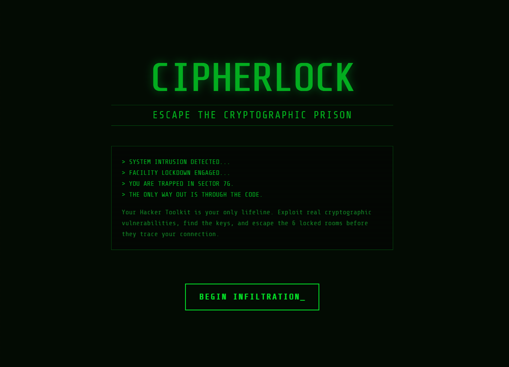
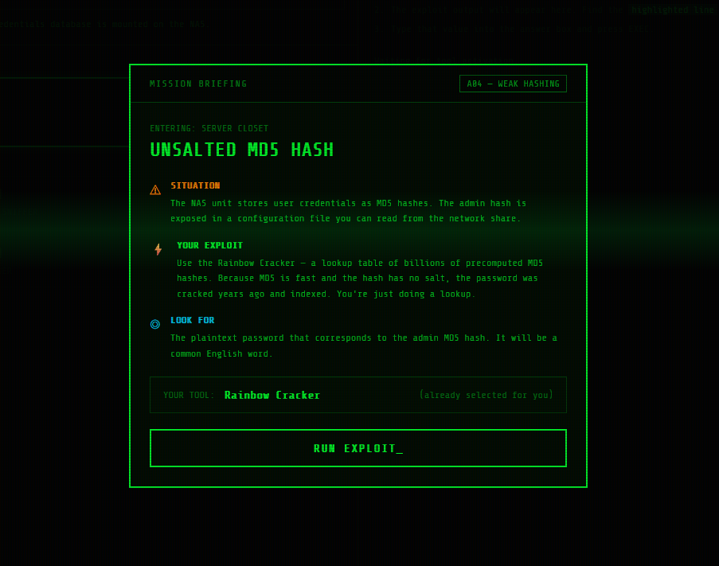
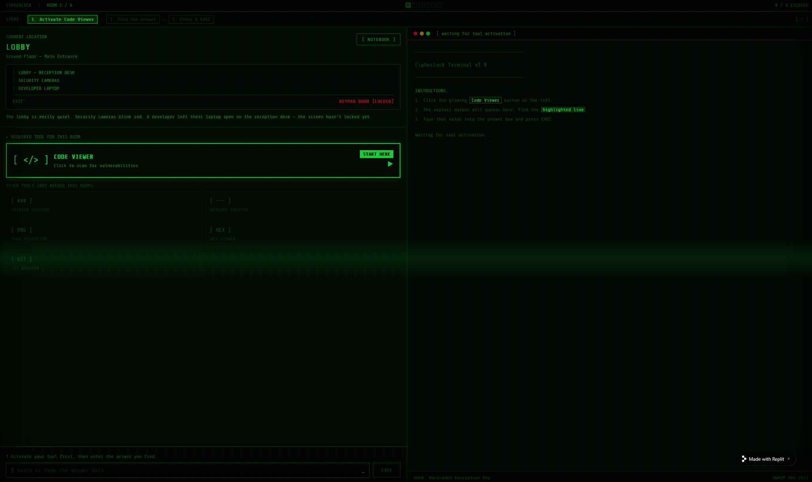
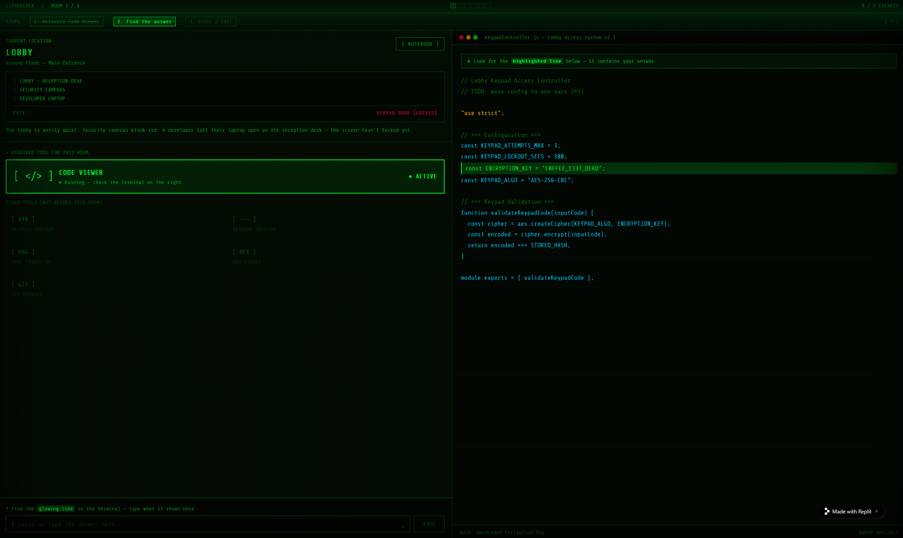
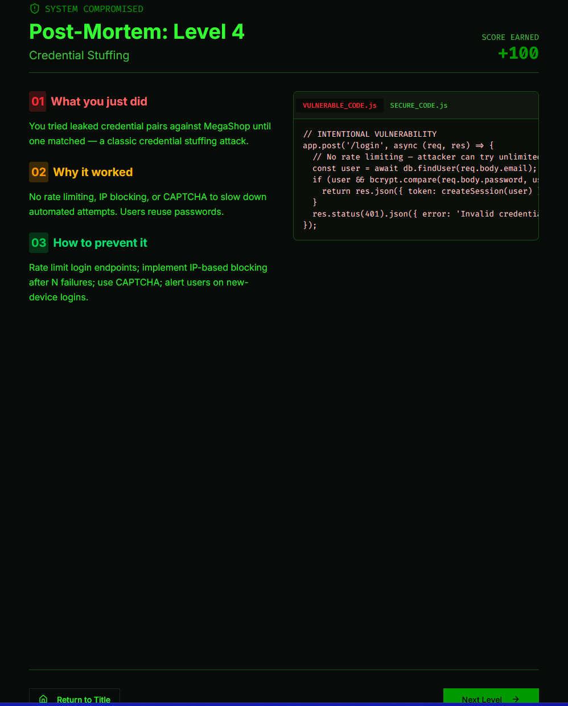
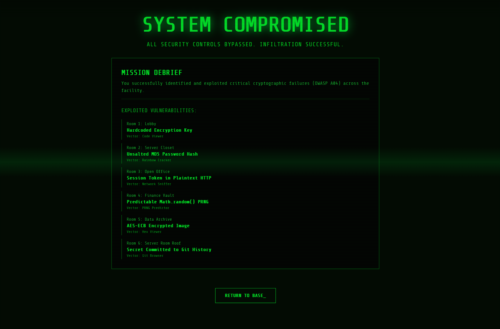

# Vibe Coding Assignment 2: Cryptographic Failures (A04:2025)

## 1. Overview: Vibe Coding Tool

For this assignment I stuck with **Replit** and its built-in AI Agent.

After using Replit for Assignment 1, I had a few reasons to keep using it instead of trying something new:

- **The workflow worked.** I already knew how to prompt the Agent to keep deliberate vulnerabilities in the code instead of "fixing" them, which is the main hurdle when building security teaching tools.
- **Free tier still covered it.(mostly)** No card required, and the monthly Agent credits were enough for a small puzzle game, however, after making multiple adjustments to the game the credits began to run out.
- **Full-stack out of the box.** This game needed real backend logic (an ECB-mode encryption demo, fake "network traffic" responses, a fake Git history endpoint), not just a frontend. Replit handles that natively without me wiring up a server.

## 2. Description of the Program

I built **CipherLock** — a virtual escape room game where the player is locked inside a fictional company's server building and has to escape by exploiting cryptographic failures in the locks, safes, and security systems guarding each room. Six rooms, six different A04 failures.

### How it plays

When the player enters a room, a **pre-brief** explains the associated vulnerability and exploit that will be covered in the room.

The player starts in the Lobby with a "Hacker Toolkit" in their inventory: a code viewer, a network sniffer, a rainbow-table cracker, a git browser, a PRNG predictor, and a hex viewer. Each room contains a locked exit that's "protected" by some form of cryptography — but in each case there is a mistake in the implementation. The player has to identify the mistake, use the right tool to exploit it, and enter the result to unlock the door.

When a room is complete the game shows a **Postmortem**:  a three-column breakdown (bug / exploit / fix) with side-by-side vulnerable vs. secure code

### The rooms

1. **Room 1 — The Lobby: Hardcoded keys.** A keypad blocks the exit. A developer's open laptop sits on the desk with source code visible. The encryption key is hardcoded in plain text near the top of the file (`const ENCRYPTION_KEY = "C0FFEE_1337_DEAD";`). Player reads it off the laptop and types it into the keypad.
2. **Room 2 — The Server Closet: Weak password hashing (MD5, unsalted).** A keycard reader needs the IT admin's password. A sticky note has the admin's MD5 hash, but no password. The Rainbow Table tool in the toolkit cracks unsalted MD5s in seconds. Player runs the hash through it, gets the password (`summer2024`), and swipes in.
3. **Room 3 — The Office: HTTP downgrade / no TLS.** The exit door needs the boss's session token. The Network Sniffer tool shows live traffic, and the boss's session cookie is shown in plaintext because the internal portal uses HTTP, not HTTPS. Player copies the token and inputs it, then walks through.
4. **Room 4 — The Vault: Weak random number generator.** A safe with a 6-digit code that "rotates every 60 seconds." A note on the safe says the codes are generated using `Math.random()` seeded with the current timestamp — and a developer's debug console shows the current seed. Using the toolkit's PRNG predictor, the player feeds in the seed and gets the next three codes. They type the active one to move on.
5. **Room 5 — The Archive: Broken cipher mode (AES-ECB).** The archive room exit needs a passphrase that's stored inside an "encrypted" image file. The image was encrypted with AES in ECB mode — which famously leaks patterns from the plaintext. The Hex Viewer reveals ECB block repetition and the decrypt key is found in the image.  The viewer decrypts using the key and the player inputs the passphrase to move on.
6. **Room 6 — The Roof: Secrets committed to Git.** The final exit is a terminal that wants the company's master signing key. A "GitHub repo" interface in the room lets the player browse commit history. Three commits back, a developer accidentally committed a `.env` file containing the master key, then removed it in the next commit — but the key is still there in Git history. The player navigates to the offending commit, copies the key, escapes the building, and wins the game.

After each room, the Code Postmortem tablet shows three things: "What was the bug" (e.g., "Hardcoded key in source"), "What we just did to exploit it" (the attack in plain English), and "How a competent developer would have written this" (e.g., "Load secrets from environment variables, never commit them, rotate them on a schedule, use AWS Secrets Manager or Vault").

### Why I chose this design

Cryptographic failures are weirdly invisible, the vulnerabilties really only show when you try to break it. An escape room forces learners to actually *use* each failure: crack a real MD5 hash, find a session cookie in plaintext. By the time you've finished the game, you've seen the failure modes with your own eyes, which sticks.

I also kept the Postmortem tablet from Assignment 1's BreachQuest because it worked well — it lands the educational payload right when the player is feeling clever from solving the puzzle, which is when they're most receptive to "here's what should have happened."

## 3. The Vulnerability: Cryptographic Failures (A04:2025)

OWASP A04 covers anything that goes wrong with the encryption, hashing, or key handling that's supposed to protect sensitive data. The category was originally called "Sensitive Data Exposure," but OWASP renamed it because the exposure is almost always the *symptom*; the *cause* is a broken crypto implementation.

Common A04 failures include:

- Sending sensitive data without TLS, or supporting weak cipher suites that allow downgrade attacks
- Storing passwords with broken or outdated hashes (MD5, SHA-1, unsalted, or plaintext)
- Hardcoding secrets in source code or accidentally committing them to Git
- Using broken cipher modes (AES-ECB instead of AES-GCM)
- Using cryptographically weak random number generators (`Math.random()` instead of a CSPRNG) for security-sensitive values like tokens, password reset links, and session IDs
- Failing to validate TLS certificates, which enables man-in-the-middle attacks

The frustrating thing about A04 is that the underlying algorithms (AES, SHA-256, TLS 1.3) are essentially uncrackable when used correctly. The failures are almost always at the *implementation* layer.

### Recent hacks (2024–2025)

- **National Public Data — 2024.** A misconfigured database at the data-broker NPD exposed roughly **2.9 billion records covering 1.3 billion people**, including full names, addresses, dates of birth, and Social Security numbers. The data was stored without adequate access controls or protective encryption.
- **184-million-record plaintext password database — May 2025.** Security researcher Jeremiah Fowler discovered an unsecured online database containing over **184 million records — including email addresses, passwords, and login URLs — stored in plain text**. The dataset spanned Apple, Google, Facebook, Microsoft, Netflix, PayPal, Amazon accounts, and even 220 `.gov` email addresses.
- **LastPass — ICO penalty November 2025.** Attackers exfiltrated a backup database containing customer password vaults. The vaults had **both encrypted fields (passwords) and unencrypted fields (website URLs)**. In 2025 LastPass also settled a class action for **$24.5 million** related to losses from vaults that attackers cracked. The ICO ruling treated this as a failure to implement appropriate technical and organisational measures affecting over a million users.
- **Prosper Marketplace — September 2025.** The peer-to-peer lender exposed **17.6 million PII records** including Social Security numbers, after attackers used compromised admin credentials with excessive database permissions.
- **Toyota subcontractor — earlier incident still cited in 2025.** A Toyota subcontractor accidentally uploaded private encryption keys and access tokens to a **public GitHub repository**, where they remained exposed for an extended period. This is the Room 6 scenario in my game.

The 2025 OWASP A04 entry also flags that organizations need to start preparing for **post-quantum cryptography (PQC)** now, because high-risk systems need to be quantum-safe by no later than end of 2030 — meaning algorithms that look fine today (RSA, classical ECC) will be A04 violations within a few years.

## 4. Problems I Ran Into (and How I Solved Them)

**Problem 1: The agent expected the user to understand cryptographic vulnerabilities from the start without ever explaining them**
The rooms that the agent built were good from a conceptual standpoint, however, they gave the user no useful context of the vulnerability being showcased.

*Fix:* I gave the agent a follow-up prompt to include a pre-breif modal that would give the user an overview of the vulnerability that would be exploited in the room they were about to play.

**Problem 2: The function to move from one room to the next was not advancing the game**
Upon completing the room, pressing the button to advance to the next room would take me back to the same room.

*Fix:* I told the agent to review the transitions between the post-mortems and the next rooms, and it found that the advanceRoom() function was not working correctly, which it promptly fixed.

**Problem 3: The agent built the game with little instructions or help for actually playing it.**
The agent built the game without placing guides or aids to show the player how to advance in a room.

*Fix:* I prompted the agent to define instructions and helpful guides within each room to give the player a notion of how to play.

## Screenshots

### Title screen 

### Pre-brief: 

### Game Screen:

### Tool Use:

### Code Postmortem after solving a room

### End Screen

