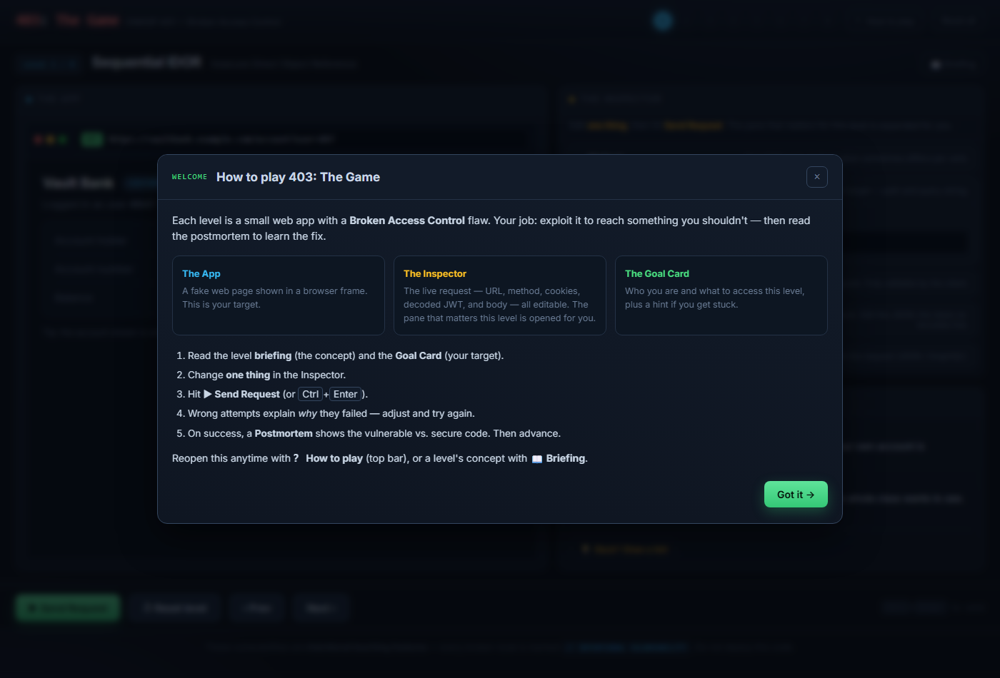
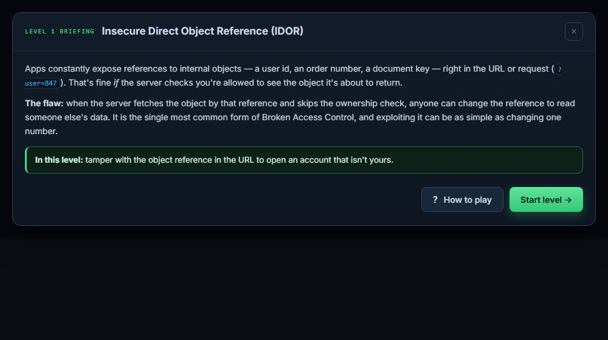
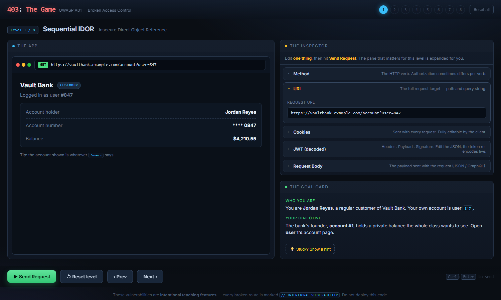
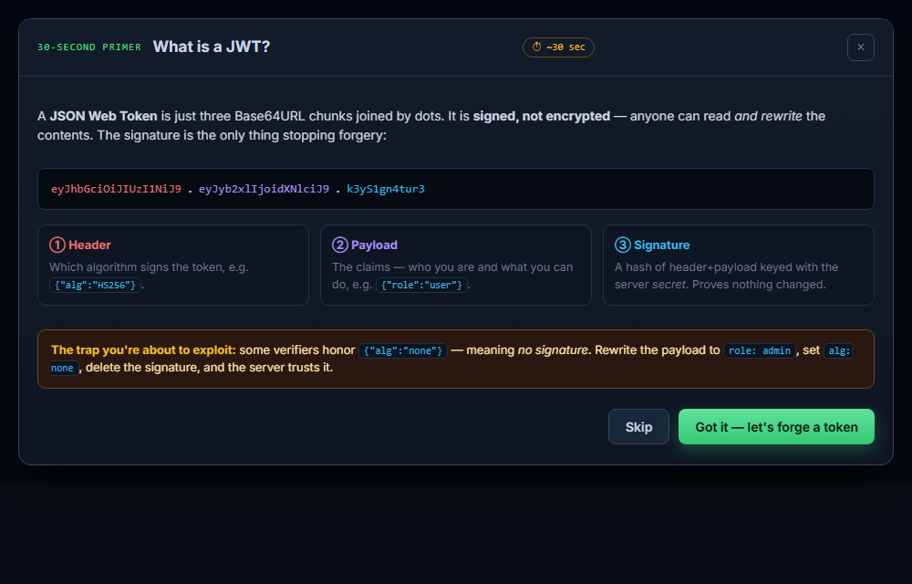
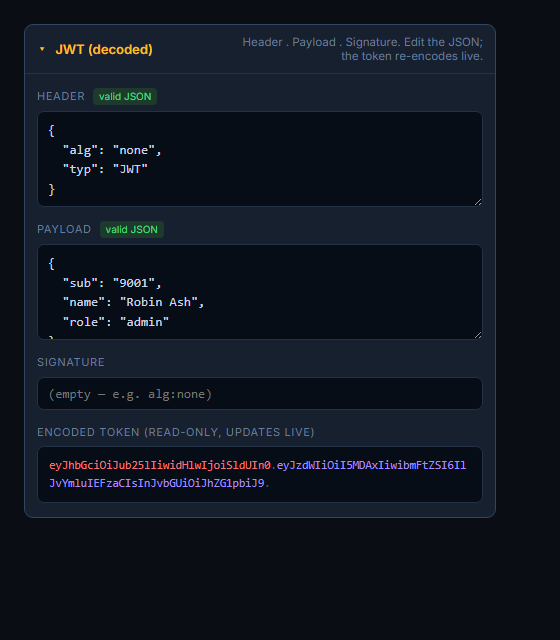
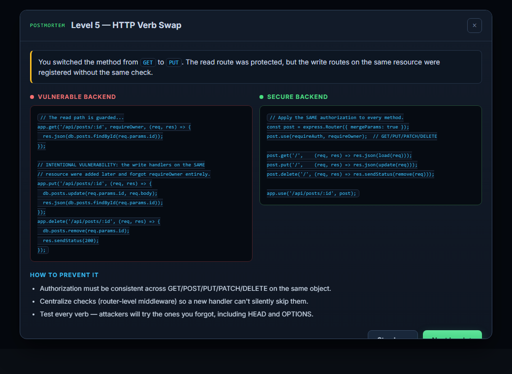
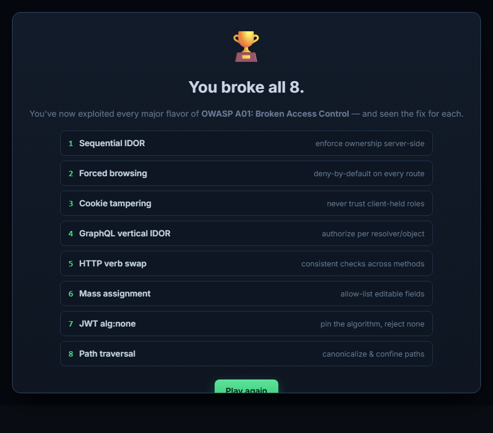

# Vibe Coding Assignment 3: Broken Access Control (A01:2025)

## 1. Overview: Vibe Coding Tool

For this assignment I switched tools and used **Claude Code** — Anthropic's command-line
coding agent — instead of Replit.

After two assignments on Replit, I wanted to compare a different style of "vibe coding":

- **Local-first, no credits to burn.** Replit's Agent credits ran low near the end of
  Assignment 2 after repeated revisions. Claude Code runs against my own files on disk, so I
  could iterate on the game as many times as I wanted without watching a meter.
- **It owns the whole project, not just a chat box.** The agent read my existing repo,
  created the files directly under `code/403-the-game/`, ran a Node test harness against its
  own puzzle logic, and even launched a headless browser to screenshot the UI and check it
  rendered — all without me leaving the terminal.
- **The deliverable is plain static files.** This game has no real backend (the "vulnerable
  vs. secure" code is *shown*, not executed), so a dependency-free HTML/CSS/JS bundle was the
  right fit. It opens by double-clicking `index.html` — nothing to deploy, nothing to host.

The trade-off: Replit gives you a live public URL out of the box, while my Claude Code build
runs locally. For a teaching tool that's all client-side simulation, local was the better fit.

## 2. Description of the Program

I built **403: The Game** — a level-based puzzle game where the player exploits **eight**
different Broken Access Control flaws, one per level. The name is the HTTP status code for
"Forbidden" — the whole game is about reaching things that should have returned 403 but
don't.

### How it plays

Every level uses the same **three-panel layout**:

- **The App** — a rendered fake web page inside faux-browser chrome (a URL bar, an HTTP-method
  pill, and a response-status badge). This is the "victim" application.
- **The Inspector** — the live request the browser is about to send: the **URL, HTTP method,
  cookies, decoded JWT, and request body**, every field editable. The Inspector is
  **level-aware** — it automatically expands the pane that matters for the current puzzle (the
  URL pane on the IDOR level, the JWT pane on the token-forgery level, and so on).
- **The Goal Card** — who the player is this level ("You are customer #847…") and what they
  need to access, plus a collapsible hint.

Before each level the player gets a **pre-brief** — a short modal that explains the
vulnerability *concept* for that level (what IDOR is, what forced browsing is, what mass
assignment is) and what they'll do, without giving away the exact keystroke. A one-time
**"How to play" tutorial** explains the three-panel layout and the play loop on first run and
can be reopened at any time. (For Level 7 the pre-brief *is* a 30-second JWT primer, since
forging a token assumes you know what a token is.)

The loop itself is deliberately simple: **change one thing in the Inspector, press Send
Request.** The engine evaluates the tampered request and either grants access or explains,
specifically, why it didn't. A key design rule was that **error messages must be diagnostic** — never a bare
"403 Forbidden." If you load the wrong account on the IDOR level it says *"that loaded your own
account #847; the founder is account #1."* If you set `isAdmin` to the string `"true"` instead
of the boolean, it tells you the check is strict. The errors teach as much as the successes.

When a level is solved, a **Postmortem** modal appears with a three-part breakdown: a one-line
summary of what just happened, the **vulnerable backend code side by side with the secure
version**, and a short "how to prevent it" list. Every vulnerable snippet is annotated with an
`// INTENTIONAL VULNERABILITY` comment so it's unmistakable that the flaw is on purpose.

### The levels

1. **Sequential IDOR.** You're customer #847 at a bank. The account page loads whatever
   `?user=` says with no ownership check. Change `?user=847` to `?user=1` to read the founder's
   account.
2. **Forced Browsing.** Your storefront dashboard has no admin link, but `/admin` exists and
   was never protected. Type the path into the URL bar to reach the admin console — hidden is
   not the same as protected.
3. **Cookie Tampering.** The app reads your role straight off a cookie. Change `role=customer`
   to `role=admin` to load the admin panel.
4. **GraphQL Vertical IDOR.** A `user(id)` GraphQL resolver returns any employee with no
   object-level authorization. Edit the query's id from your own to `"1"` to read the CEO's
   salary.
5. **HTTP Verb Swap.** `GET /api/posts/42` is guarded by an ownership check, but the `PUT`,
   `PATCH`, and `DELETE` handlers on the same path never got one. Switch the method to modify a
   post you can't even read.
6. **Mass Assignment.** A profile-update endpoint spreads the whole request body onto your user
   record. Add a field the form never showed — `"isAdmin": true` — to escalate yourself.
7. **JWT `alg:none`.** The API accepts unsigned tokens. Rewrite the payload to `role: admin`,
   set the header `alg` to `none`, and delete the signature to forge an admin token. A
   **30-second JWT primer** plays automatically right before this level.
8. **Path Traversal.** A download endpoint joins your `file=` value straight onto its base
   directory. Use `file=../admin/secrets.txt` to climb out of the documents folder and read the
   admin secrets.

### Why I chose this design

Broken Access Control isn't a single bug — it's the broadest category in the OWASP Top 10, and
it's currently **#1**. A single login screen can't represent it the way it represented
Authentication Failures in Assignment 1. So instead of one mechanic I built an **Inspector**: a
tool that exposes every part of an HTTP request and lets the player tamper with it. The same
tool, level after level, makes the through-line obvious — *almost every access-control failure
comes down to the server trusting something the client controls* (an id, a path, a cookie, a
method, a token, a body field).

I kept the **Postmortem** idea from BreachQuest and CipherLock because it lands the lesson at
the moment the player feels clever. Putting the vulnerable and secure code right next to each
other makes the fix concrete: it's usually one line — an ownership check, an allow-list, a
pinned algorithm, a confined path.

## 3. The Vulnerability: Broken Access Control (A01:2025)

Access control enforces *what an authenticated user is allowed to do*. (It is distinct from
*authentication*, which is **who** you are — that was Assignment 1.) Broken Access Control is
what happens when those "what are you allowed to do" checks are missing, inconsistent, or
trust data the user can change. OWASP ranked it the **#1** web application risk in 2021, and it
remains at the top of the 2025 list — the most common serious weakness found in real
applications.

Common A01 failures include:

- **IDOR (Insecure Direct Object Reference):** using a client-supplied id to fetch a record
  without checking that the record belongs to the caller — horizontally (another user's data)
  or vertically (a higher-privileged record). In API terms this is **BOLA**, Broken Object
  Level Authorization, which is **#1 on the OWASP API Security Top 10**.
- **Missing function-level authorization / forced browsing:** privileged routes that are merely
  unlinked rather than protected, so anyone who knows or guesses the URL reaches them.
- **Privilege escalation via client-controlled state:** trusting a role stored in a cookie,
  hidden form field, or unverified token.
- **Metadata / token tampering:** forging a JWT (e.g. accepting `alg:none`, or RS256→HS256
  algorithm confusion) to claim privileges you weren't granted.
- **Mass assignment:** binding a request body straight onto a model so the client can set
  fields the UI never exposed (`isAdmin`, `role`, `balance`).
- **Inconsistent enforcement:** an authorization check on one HTTP method but not the others on
  the same resource.
- **Path traversal:** unsanitized file paths (`../`) that escape an intended directory and read
  files the endpoint was never meant to serve.

The frustrating thing about A01 is that the fix is almost always cheap and the failure is
almost always an *omission*: a check that was never written, or was written once and skipped on
the next handler. The defensive principle is **deny by default** — every request is refused
unless an explicit, server-side rule allows it — and **never trust the client** for anything
that decides authorization.

### Recent incidents (illustrative — verify before final submission)

- **Optus (2022, widely cited through 2024–2025).** An **unauthenticated, internet-exposed API
  endpoint** let attackers pull personal records for roughly **9.8 million** customers. The
  textbook broken-access-control failure: a sensitive endpoint with no authorization in front
  of it.
- **Dell partner portal (2024).** A reseller-portal API that returned order information by
  identifier reportedly allowed large-scale enumeration of around **49 million** records — an
  IDOR/BOLA-style weakness where the endpoint trusted the supplied identifier and lacked
  effective rate limiting.
- **Trello (2024).** A public API endpoint could be queried with a list of email addresses to
  link them to existing accounts, enabling enrichment of profile data for tens of millions of
  records — broken object-level authorization on a "convenience" endpoint.
- **API security broadly (2024–2025).** Industry reports continued to rank **BOLA / broken
  object level authorization** as the most common and most damaging API vulnerability class,
  consistent with A01 sitting at #1 for web applications.

> Note: confirm the specific figures and dates above against primary sources before submitting,
> the same way the earlier assignments cite their incidents.

## 4. Problems I Ran Into (and How I Solved Them)

**Problem 1: The path-traversal level's math didn't reach the target file.**
My first version served downloads from a base directory of `/var/docs`. With that base, a
single `../admin/secrets.txt` only climbs to `/var/admin/secrets.txt`, not the intended
`/admin/secrets.txt` — so the exact payload the level *told* the player to use didn't actually
win. I caught this with a small Node test harness that runs every level's win condition.

*Fix:* I changed the base directory to a single-level `/docs`, so `../admin/secrets.txt`
resolves precisely to `/admin/secrets.txt` and the documented payload works. (I also kept the
resolver lenient so `../../admin/secrets.txt` succeeds too.)

**Problem 2: Wrong answers risked being unhelpful "403"s.**
The whole point of the game is that the *errors* teach. An early pass had a few branches that
just denied the request without saying why.

*Fix:* I rewrote each level's `evaluate()` to branch on the *kind* of wrong answer and return a
specific diagnostic — e.g. "you changed the role but the token is still signed with HS256, so
the server will recompute the signature and reject it; switch `alg` to `none` and drop the
signature." Every wrong attempt now names what's still missing.

**Problem 3: One Inspector, five panes — which one does the player touch?**
Showing the URL, method, cookies, JWT, and body on every level (as the design required) made it
unclear where to act.

*Fix:* I made the Inspector **level-aware**: each level declares which pane is relevant, and the
engine expands exactly that pane by default while leaving the others collapsed but available.

**Problem 4: JWTs are intimidating if dropped on the player cold.**
Level 7 asks the player to hand-edit a token's header and payload, which assumes they know what
those are.

*Fix:* I added a **30-second JWT primer** that fires automatically just before Level 7 —
explaining the header/payload/signature structure, that a JWT is *signed, not encrypted*, and
why a verifier honoring `alg:none` is dangerous — then drops them straight into forging one.

**Problem 5: The player was dropped into each puzzle with no concept and no instructions.**
Like my Assignment 2 experience, the first build assumed the player already understood the
vulnerability and already knew how the game worked. There was no onboarding.

*Fix:* I generalized the Level 7 primer idea into a **per-level pre-brief** — every level now
opens with a modal that teaches the vulnerability concept before the player touches anything —
and added a one-time **"How to play" tutorial** that explains the three-panel layout and the
edit-one-thing / Send-Request loop. Both are reopenable from the toolbar so they never block a
returning player.

## Screenshots

### The "How to play" tutorial (first run)

### A per-level pre-brief explaining the concept

### Level 1 — the three-panel layout (App / Inspector / Goal Card)

### The 30-second JWT primer before Level 7 (Level 7's pre-brief)

### The JWT inspector pane (forging an alg:none token)

### Postmortem — vulnerable vs. secure code side by side

### Completion screen

