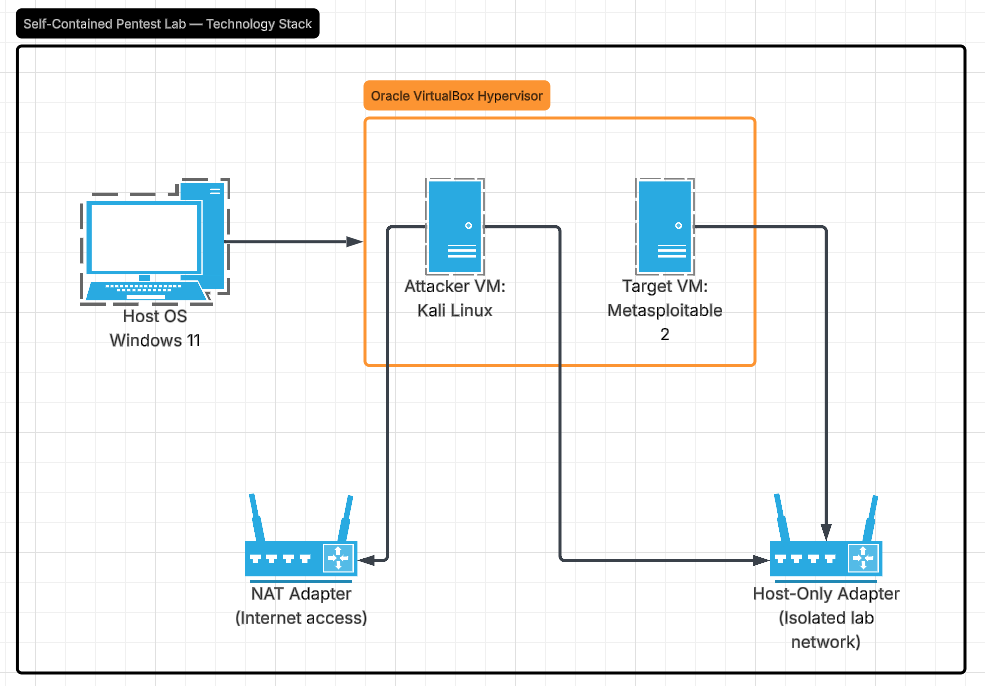
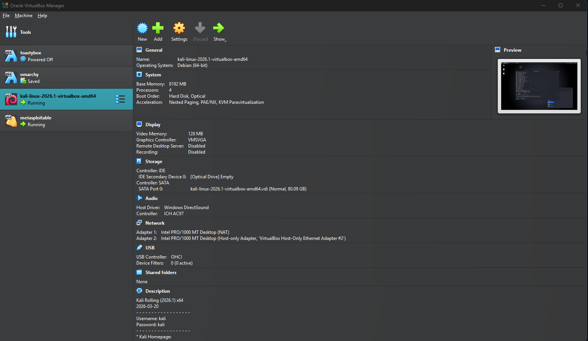
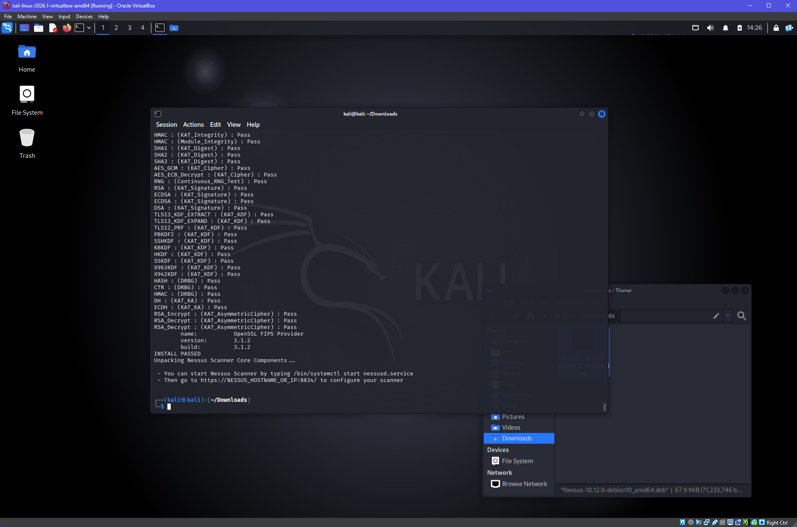
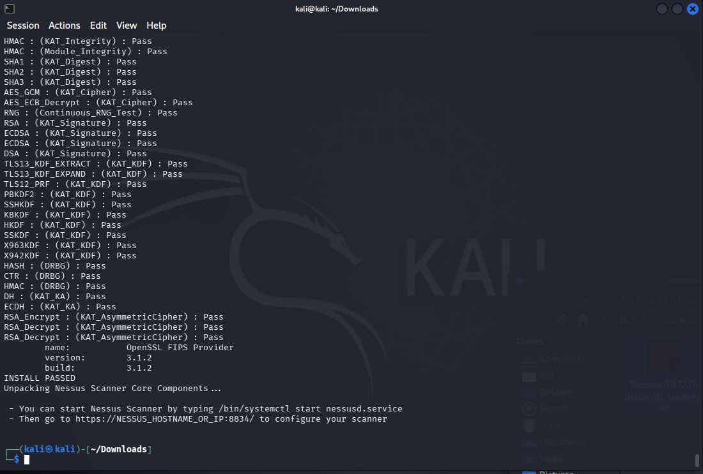
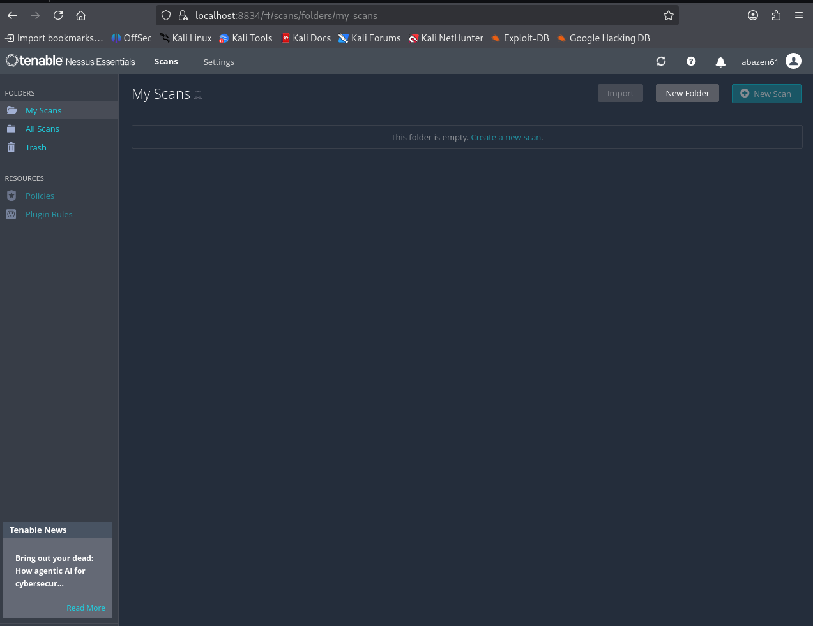
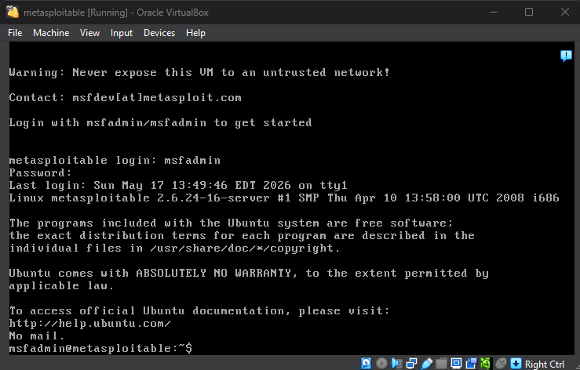
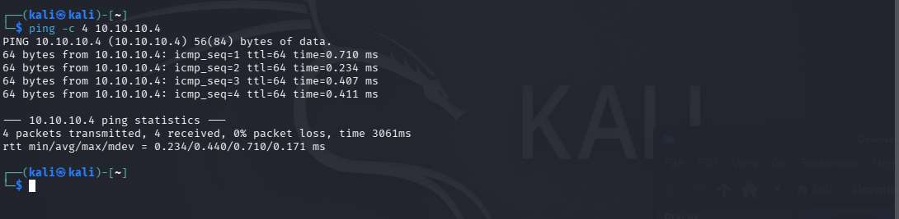

# Project 1: Penetration Testing Lab Setup

**Course:** MSSE642
**Assignment:** Hands-On Assignment #1 — Pen Testing Lab Setup with Kali Linux
**Date:** May 2026

---

## 1. Overview — Technology Stack

This lab establishes a self-contained penetration testing environment on my local workstation. The full stack is:

| Layer | Component |
|---|---|
| Host hardware | Windows 11 PC (x86_64) |
| Host OS | Windows 11 |
| Type 2 Hypervisor | Oracle VirtualBox 7.x |
| Attacker VM | Kali Linux (pre-built VM) |
| Target VM | Metasploitable 2 (pre-built VM) |
| Lab network (isolated) | VirtualBox Host-Only Network |
| Internet access (Kali only) | VirtualBox dual net adapter NAT/Host-Only |

**Network design rationale:** Kali is configured with **two network adapters** — a NAT adapter for internet access and a Host-Only adapter for the lab network. This lets Kali pull packages, exploits, and tools from the internet while still reaching the isolated Metasploitable target. 
Metasploitable, by contrast, has **only the Host-Only adapter** since it is intentionally vulnerable software and should never touch a real network. 

**Why this stack:** VirtualBox is free, runs well on Windows, and supports the pre-built `.ova` / `.vmdk` images that both Kali and Metasploitable ship as.

---

## 2. Architecture Diagram

The lab consists of two VMs hosted by VirtualBox on my Windows PC. Kali has two net adapters (one to NAT for internet, one to the host-only lab network). Metasploitable has only one, on the host-only network to isolate it.



**Components and links:**

- **Host PC** — Windows 11, runs VirtualBox
- **Kali Linux VM** (attacker)
  - `eth0` → VirtualBox **NAT** 
  - `eth1` → VirtualBox **Host-Only Adapter** 
- **Metasploitable 2 VM** (target)
  - `eth0` → VirtualBox **Host-Only Adapter** 
  - *No internet access — by design.*
- **VirtualBox Host-Only Network** — isolated from the physical LAN and from the internet. This is the path used for attacker → target traffic.

---

## 3. Virtualization Environment Running (VirtualBox)

Screenshot of the VirtualBox Manager showing both VMs registered:



Both the Kali Linux VM and Metasploitable 2 VM are visible in the left panel.

---

## 4. Kali Linux VM Running — Logged In

Screenshot of Kali Linux booted and logged in to the desktop:



---

## 5. Nessus Installed on Kali

Because Kali has a NAT adapter for internet access, Nessus Essentials was downloaded directly from Tenable inside the Kali VM, installed via `dpkg`.

**Install steps performed:**

```bash
# In Kali's Firefox, downloaded the Debian package from
# https://www.tenable.com/downloads/nessus

cd ~/Downloads
sudo dpkg -i Nessus-*-debian10_amd64.deb
sudo systemctl start nessusd
sudo systemctl enable nessusd

# Nessusd setup as a system service and enabled
# Opened https://localhost:8834 in the Kali browser to complete activation
```

Screenshot of Nessus installed through kali terminal:



Screenshot of the Nessus web UI running at `https://localhost:8834`:



---

## 6. Metasploitable 2 Running

Metasploitable 2 was downloaded from SourceForge on the Windows host, the `.vmdk` was attached as an existing virtual hard disk in a new VirtualBox VM, and the network adapter was set to **Host-Only only**.

Screenshot of the booted Metasploitable 2 VM:



---

## 7. Ping from Kali to Metasploitable 2

Both VMs share the same VirtualBox Host-Only network, so Kali can reach Metasploitable at layer 3 over its `eth1` interface.

Screenshot of a successful `ping` from Kali to Metasploitable 2:



---

## 8. Problems Encountered and Resolutions

### Problem 1: How to download Nessus on a host-only-isolated Kali box
**Symptom:** With Kali initially configured on Host-Only only, Firefox could not reach `tenable.com` — the lab network has no internet route.
**Cause:** Host-Only networks are intentionally isolated from the host's physical LAN and the internet.
**Resolution:** Added a **second network adapter** to the Kali VM (Settings → Network → Adapter 2 → enable, set to NAT). This gave Kali an `eth0` interface with internet access (typically `10.0.2.X` from VirtualBox's NAT DHCP) while keeping `eth1` on the host-only lab network. Nessus was then downloaded directly inside Kali. Metasploitable was deliberately **not** given a second adapter for isolation.

---