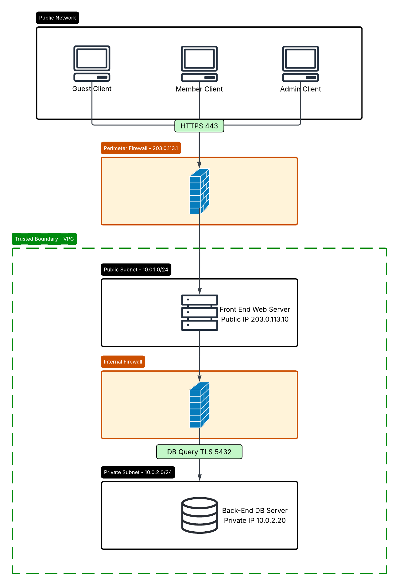

# Project 2 — Secure Software Development Lifecycle and Threat Model

**Course:** MSSE 642
**Application:** Hiking Club Application
**Group members:** Andrew Bazen, Depen Tamang, Anusha Reddy

---

## Part 1 — Secure Design Document Overview

### Project Description

The Hiking Club Application is a web-based system designed to help a hiking organization manage hiking events and member participation. The application allows guests to browse upcoming hiking trips, while registered members can sign in, manage their profiles, and register for events. Trip leaders and administrators have additional permissions to create and manage events, review member participation, and manage financial operations for paid trips. The system stores both public and confidential information, including member medical information and payment-related data. Because the application handles sensitive user information and administrative operations, security is an important part of the system design.

### Organization Description

The organization using this application is a community hiking club that organizes outdoor hiking trips and activities for its members. The club includes regular members, trip leaders, and system administrators. Members use the application to browse and register for events, while trip leaders organize hiking trips and manage attendance. System administrators are responsible for account management, financial operations, and maintaining the integrity of the platform.

### Deployment Environment

The Hiking Club Application will be deployed in a cloud-hosted environment using separate frontend and backend servers. The frontend web server will be publicly accessible over the internet and will handle client requests, authentication, and application logic. The backend database server will be deployed in a private network that is not directly accessible from the internet. Firewalls will separate public-facing systems from internal systems to reduce the risk of unauthorized access. Communication between users and the web server will use HTTPS encryption to protect sensitive information during transmission.

### Secure Software Concepts

Several secure software concepts are important for the Hiking Club Application. The system requires strong authentication and authorization because different user roles have different access levels. Members should only be able to edit their own profiles, while administrators should have elevated permissions for administrative functions. Sensitive information such as medical notes and payment information must be protected from unauthorized access.

Input validation is necessary to reduce the risk of attacks such as SQL injection and cross-site scripting. Passwords should be securely hashed before being stored in the database. The application should also use HTTPS to encrypt network communication between users and the server. Logging and auditing mechanisms should be implemented to track administrative actions and detect suspicious activity. In addition, the backend database server should remain isolated within a private network protected by firewalls to minimize direct exposure to attackers.

---

## Part 2 — Threat Model Assessment

### Part 2A — Architecture and Data Flow Diagram

_Diagram to be inserted here. Save the image to the `images/` directory and reference it as shown below._

The diagram depicts the Guest, Member, and Admin web clients connecting over the public internet (HTTPS) to the Front End Web Server on the public subnet, which is the only component permitted to communicate across the internal firewall with the Backend Database Server on the private subnet. Trust boundaries are shown as dashed lines separating the public internet from the public-facing subnet, and the public subnet from the private database subnet.

---

### Part 2B — STRIDE Threat Model

The following STRIDE analysis identifies threats specific to the Hiking Club Application, organized by the six STRIDE categories.

**Spoofing.** Because the application authenticates members, trip leaders, and system administrators, an attacker who can impersonate one of these identities can act with that user's privileges. Spoofing threats include credential theft through phishing, the use of weak or reused passwords, and session hijacking where an attacker steals a valid session token to assume a logged-in user's identity. The highest-value spoofing target is the system administrator account, since it controls the treasury portal where money is collected and withdrawn. If an attacker spoofs an administrator, they could move funds or create rogue accounts. Mitigations such as multi-factor authentication for privileged accounts, secure session management with short-lived tokens, and account lockout after repeated failed logins directly reduce this risk.

**Tampering.** Tampering threats target the integrity of data either in transit or at rest. A malicious member could attempt to manipulate registration requests to bypass the waitlist, or alter request parameters to change event maximum and minimum limits that only the owning trip leader is supposed to set. Tampering with data in transit is possible if traffic is not encrypted, which is why the design specifies HTTPS for all client-to-server communication. At the database level, a SQL injection attack could allow an attacker to modify member records, event data, or financial entries. The requirement that system administrators run sanity checks to ensure the database has not been tampered with is a direct response to this category of threat, and parameterized queries plus server-side validation are the primary preventive controls.

**Repudiation.** Repudiation occurs when a user performs an action and later denies having done so, and the system has no reliable way to prove otherwise. In this application the most serious repudiation concerns involve financial and administrative actions: an administrator who withdraws money from the treasury could deny doing so, or a trip leader who drops a member from an event could dispute the action. Without trustworthy logs, the club cannot establish accountability or reconstruct what happened. The design's logging and auditing mechanisms address this threat by recording administrative actions, financial transactions, and authentication events with timestamps and the responsible user identity, so that actions can be attributed and disputes resolved.

**Information Disclosure.** The application stores confidential data including member medical information, private notes written about members by trip leaders, and payment-related data, all of which must be restricted to authorized roles. Information disclosure threats include broken access control that lets a regular member view another member's confidential record by manipulating an identifier in a request (an insecure direct object reference), verbose error messages that leak internal details, unencrypted backups, and the interception of unencrypted network traffic. Because members are permitted to see only non-confidential information about other members, any flaw that exposes medical notes or financial data crosses an important confidentiality boundary. HTTPS in transit, encryption of sensitive data at rest, and strict server-side authorization checks on every confidential endpoint are the key countermeasures.

**Denial of Service.** As a public-facing web application, the Front End Web Server is exposed to denial-of-service threats that aim to limit the service availability to legitimate users. An attacker could flood the server with traffic, submit resource-intensive requests that exhaust database connections, or use automated scripts to rapidly consume all open spots on popular events so that genuine members cannot register. Although availability may seem lower-stakes than confidentiality here, a sustained outage during a registration period undermines the club's core function. Rate limiting, request throttling, input size limits, and cloud-provider protections such as load balancing and DDoS mitigation reduce exposure to this category.

**Elevation of Privilege.** Elevation-of-privilege threats arise when a user gains capabilities beyond their assigned role. A regular member might attempt to escalate to trip-leader or administrator privileges by manipulating a role value or exploiting a missing authorization check, gaining the ability to post events, view confidential member data, or reach the treasury portal. A more subtle case exists within the admin tier itself: a trip leader is only authorized to manage the events they created, so a flaw that lets one trip leader modify or delete another trip leader's events is also an elevation of privilege. Enforcing role-based access control on the server for every action, applying the principle of least privilege, and verifying object ownership before allowing edits are the controls that prevent this kind of threat.

---

### Part 2C — OWASP Threat Model

This section follows the OWASP generic threat-modeling steps: defining the assessment scope, identifying vulnerabilities, defining countermeasures, and prioritizing the resulting risks.

#### Assessment Scope — What's on the line?

The assessment covers the full Hiking Club Application: the Front End Web Server on the public-facing subnet, the Backend Database Server on the private subnet, and the Guest, Member, and Admin web client views, along with the trust boundaries between the public internet and the web server and between the web server and the database.

The assets that need protection are the data and capabilities the system exposes. These include member personally identifiable information; confidential medical information and the private notes trip leaders record about members; authentication credentials and session tokens; payment information and the treasury funds and financial records that administrators manage; and the integrity and availability of event and registration data. Because the application combines health-related data, financial operations, and tiered administrative access, both the confidentiality of stored data and the integrity of financial and event records are central to the scope.

#### Vulnerabilities — What are they?

The most significant vulnerability classes for this application map to well-known OWASP Top 10 categories:

Broken access control (OWASP A01) is the leading concern, because the system has multiple roles with sharply different permissions and confidential data that must stay hidden from regular members; missing or inconsistent server-side authorization checks could expose medical notes, allow one trip leader to alter another's events, or grant access to the treasury portal. Injection (A03), particularly SQL injection through unvalidated input, threatens the integrity and confidentiality of the database, and cross-site scripting could allow malicious scripts to run in other users' browsers. Cryptographic failures (A02) would arise from transmitting data without HTTPS, storing passwords without strong hashing, or leaving sensitive data unencrypted at rest. Identification and authentication failures (A07) include weak password policies, absent multi-factor authentication on privileged accounts, and poor session management. Security logging and monitoring failures (A09) would leave administrative and financial actions unaccountable and slow the detection of attacks. Finally, security misconfiguration (A05) — such as an over-permissive firewall rule, a database reachable from the internet, or default credentials — could undermine the network isolation the design depends on.

#### Countermeasures — What can you do about it?

For broken access control, authorization must be enforced on the server for every request, ownership of objects must be verified before any edit, and the principle of least privilege applied so that each role receives only the permissions it needs. Injection is addressed with parameterized queries or prepared statements, server-side input validation, and output encoding to neutralize cross-site scripting. Cryptographic failures are mitigated by requiring HTTPS for all traffic, hashing passwords with a strong adaptive algorithm such as bcrypt or Argon2, and encrypting sensitive data at rest. Authentication is strengthened with enforced password complexity, account lockout, secure session tokens, and multi-factor authentication for trip leaders and administrators. Logging and monitoring countermeasures include recording authentication events, administrative actions, and treasury transactions with user attribution and timestamps, and reviewing those logs for suspicious activity. Network-level misconfiguration is countered by keeping the database on a private subnet behind a firewall that permits only the Front End Web Server to connect, granting the application a least-privilege database account, and handling payments through a PCI-compliant processor rather than storing card data directly.

#### Prioritized Risks — Listed in order

Risks are ranked by overall risk level, considering both the likelihood of exploitation and the impact on the club's data and operations.

1. **Broken access control exposing confidential data** — High impact and high likelihood. A missing authorization check could reveal member medical information and private notes or grant unauthorized access to the treasury, breaching both privacy and financial integrity.
2. **Compromise of administrator or treasury accounts (spoofing / elevation of privilege)** — High impact. Control of an admin account allows fund withdrawal, account creation, and access to all confidential data, making it a top target.
3. **Injection attacks (SQL injection / XSS)** — High impact and moderate likelihood. Successful injection can read, alter, or destroy database records and compromise other users' sessions.
4. **Sensitive data exposure from cryptographic failures** — High impact. Weak hashing or missing encryption in transit or at rest exposes credentials and personal data if any layer is breached.
5. **Insufficient logging and repudiation of financial actions** — Moderate impact. Inadequate audit trails prevent the club from proving who performed treasury withdrawals or member drops and slow detection of attacks.
6. **Denial of service against the public web server** — Lower relative priority. An outage disrupts browsing and event registration but does not by itself compromise confidential data or funds.