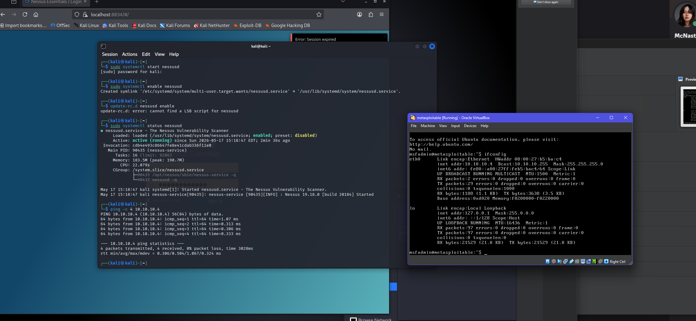
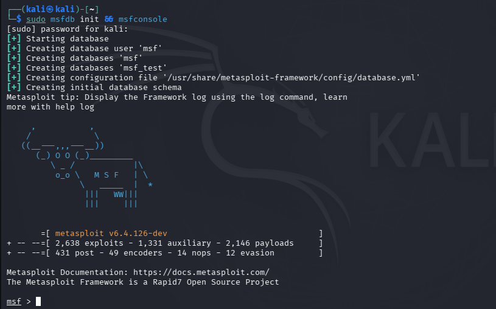
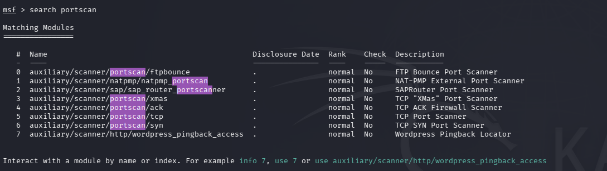
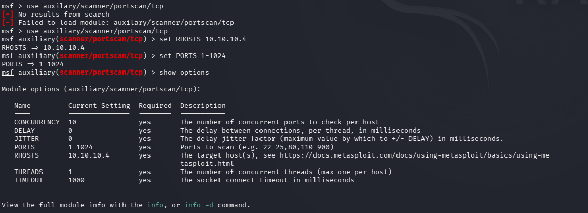
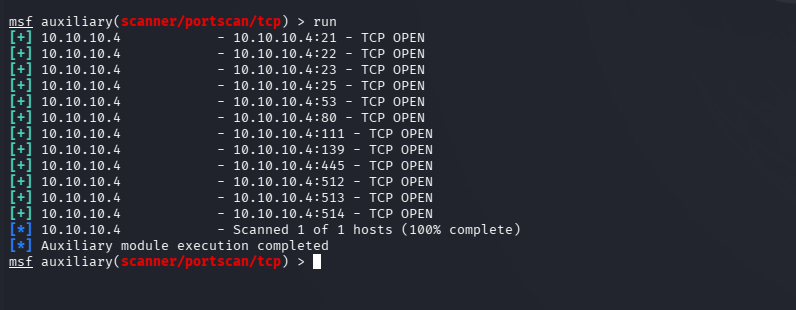
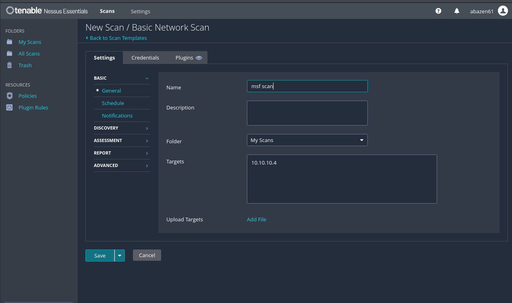
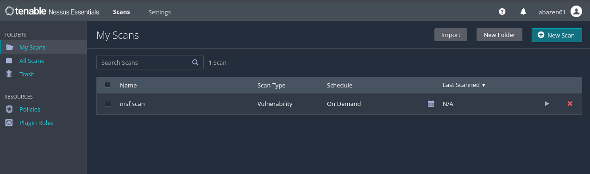
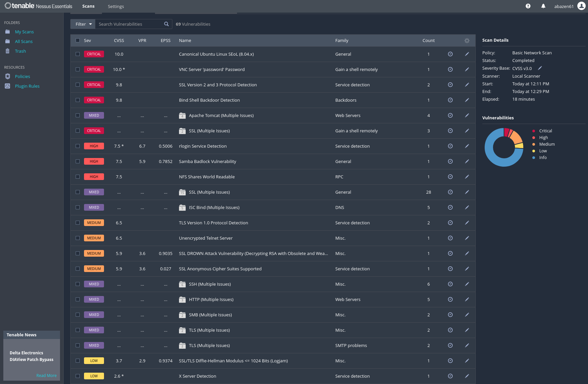
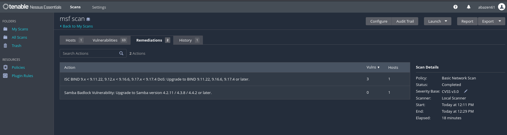

# Project 3 — Penetration Testing with Kali Linux, Metasploit, and Metasploitable2

**Group members:** Depen Tamang, Andrew Bazen, Anusha Reddy

---

### References

- Singh, G. (2019). *Learn Kali Linux 2019* (esp. Section 3, Chapters 7–8). Birmingham, UK: Packt Publishing.
- Tenable, Inc. *Nessus vulnerability scanner.* <https://www.tenable.com/products/nessus>
- Tenable, Inc. *Nessus Essentials.* <https://www.tenable.com/products/nessus/nessus-essentials>
- Rapid7. *Metasploitable 2* (intentionally vulnerable target VM).

---

## Part 1 — Starting Metasploit Framework and Metasploitable2

Both virtual machines (Kali Linux and Metasploitable2) were started in VirtualBox and confirmed to be connected over the private network. The Metasploit Framework console was then launched in kali.

**Screen Shot 1 — both VMs running and connected**



> Shows both VMs powered on and a successful connection between Kali and Metasploitable2 using ping at address `10.10.10.4`.

```bash
sudo msfdb init && msfconsole
```

**Screen Shot 2 — Metasploit Framework running**



> Shows the `msfconsole` banner and the `msf >` prompt after `msfdb init` completes.

---

## Part 2 — Port Scan of the Target VM with Metasploit

The auxiliary scanner modules were searched and narrowed to the port scanners, then the TCP port scanner was selected and configured against the Metasploitable2 target.

```bash
# Narrow the auxiliary scanners down to port scanners only
search portscan

# Select the TCP port scanner
use auxiliary/scanner/portscan/tcp

# Point it at the Metasploitable2 target
set RHOSTS 10.10.10.4

# Limit the scan to the well-known port range
set PORTS 1-1024

# confirm settings
show options

# Run the scan
run
```

**Screen Shot 3 — port scanners only**



> Shows the result of `search portscan` with a list reduced to port-scanner modules, **not** the full scanner list.

**Screen Shot 4 — configured module options**



> Shows options after selecting the TCP scanner and setting `RHOSTS = 10.10.10.4` and `PORTS = 1-1024`.

**Screen Shot 5 — port scan results**



> Shows the open TCP ports discovered on Metasploitable2 and the `Auxiliary module execution completed` message.

---

## Required Questions

**a. What is the purpose of port scanning from the perspective of a Black Hat hacker?**

For a black hat, port scanning is unauthorized reconnaissance. By discovering which ports are open and which services are listening, the attacker maps the target's attack surface. Each open port is a potential way in, and the service/version information lets the attacker match the target against known vulnerabilities and ready-to-deploy exploits. The black hat uses this as the information-gathering step to precede an intrusion, which is performed illegally and as quietly as possible to avoid detection.

**b. What is the purpose of port scanning from the perspective of an Ethical (White Hat) hacker?**

A white hat runs the same scan, but with authorization and defensive intent, as part of a security assessment. The goal is to outline the organization's exposed services, identify unnecessary open ports and any outdated, misconfigured, or vulnerable services, and report them so they can be remediated.  The white hats goal is to close ports that don't need to be open, patch outdated software, and tighten firewall rules. The technique is identical to the black hat's, but the difference is permission and the purpose of finding and fixing weaknesses before a real attacker exploits them.

**c. Why did we restrict the scanned ports to 1 through 1024?**

Ports 1–1024 are the "well-known" system ports where the most common standard services run, for example FTP (21), SSH (22), Telnet (23), SMTP (25), DNS (53), and HTTP (80). Restricting the scan to this range focuses on the most likely exploitable services, and makes the scan far faster than checking all ports. It makes sense for this lab as an efficient port range since many of Metasploitable2's deliberately vulnerable services fall within it.

---

## Part 3 — Tool Research: Nessus

### Introduction

Nessus is a widely used network vulnerability scanner developed by Tenable, Inc. It was originally created by Renaud Deraison in 1998 as an open-source project and became proprietary in 2005 with the release of Nessus 3; Tenable now develops and maintains it. Nessus scans hosts and networks for known vulnerabilities, missing patches, misconfigurations, and default or weak credentials using a large, regularly updated library of plugins mapped to CVEs (Common Vulnerabilities and Exposures). It reports each finding with a severity rating and remediation guidance, making it a great tool for vulnerability assessment.

### Big Picture — where it fits in the penetration testing process

Nessus belongs to the **vulnerability scanning / assessment** stage of a penetration test, which follows reconnaissance and information gathering and comes before gaining access (exploitation). Singh's *Learn Kali Linux 2019* Chapter 8, "Understanding Network Penetration Testing" frames the overall process of information gathering, scanning, gaining access, and the post-connection stages that follow. Within that flow, once a tester has identified live hosts and open ports/services, for example with Nmap or the Metasploit TCP port scanner used in Part 2, Nessus automates the next step: checking those services against a database of known vulnerabilities to determine which are likely exploitable. Importantly, Nessus identifies and prioritizes weaknesses but does not exploit them itself.  Instead, its output feeds the gaining-access/exploitation phase, where a framework like Metasploit takes over.

### Lab

Nessus is **not** part of the default Kali Linux installation. Unlike Nmap or Burp Suite Community Edition, which ship with Kali, Nessus must be downloaded from Tenable and installed manually.

Installation and registration for **Nessus Essentials** was completed in  and used in the lab following these steps:

1. I created a new scan using the **Basic Network Scan** template, set the target to `10.10.10.4` (the address of my metasploitable VM instance)

**Screen Shot — Basic Network Scan Created**



> shows the web UI of Nessus with the new scan and the target set to the metasploitable VM address.

2. I then saved it with the updated target.

**Screen Shot — Basic Network Scan saved**



> shows the web UI of Nessus with the saved scan.

3. I then launched it and waited for the scan to complete.


**Screen Shot — Nessus scan results against Metasploitable2**



> shows the scan results of the Nessus Vulnerability Scanner.

Because Metasploitable2 is intentionally vulnerable, the scan returned a large number of findings across the full severity range. Critical results included an end-of-life Canonical Ubuntu 8.04 operating system, a VNC server protected only by the password "password," a Bind Shell backdoor, and the detection of obsolete SSL version 2 and 3 protocols. High-severity findings included an exposed rlogin service, the Samba "Badlock" vulnerability, and world-readable NFS shares. Medium-severity findings flagged an unencrypted Telnet server, TLS 1.0, the SSL DROWN vulnerability, and anonymous SSL cipher suites, and grouped "Multiple Issues" entries covered Apache Tomcat, SSH, HTTP, and ISC BIND. 

**Screen Shot — Nessus suggested Remediations**



> shows the remediations proposed from the Nessus Vulnerability Scanner.

Beyond listing vulnerabilities, Nessus also produced a Remediations tab with prioritized fixes, upgrading ISC BIND to a patched 9.x release to resolve a denial-of-service flaw, and upgrading Samba to address the Badlock vulnerability.  This shows how the same scan surfaces weaknesses and also guides their correction.

### Conclusion

Nessus is an industry-standard vulnerability scanner that automates the discovery and prioritization of known security weaknesses, fitting clearly into the scanning/vulnerability-analysis phase of a penetration test. Although it is not bundled with Kali Linux, it is easy to install and set up for use in a free pen-testing setup. Run against the vulnerable Metasploitable2 target, Nessus surfaces a wide range of critical and high-severity issues, demonstrating both the depth of automated vulnerability assessment and the value of being able to use such a tool to identify and remediate exposures before attackers can take advantage of them.
