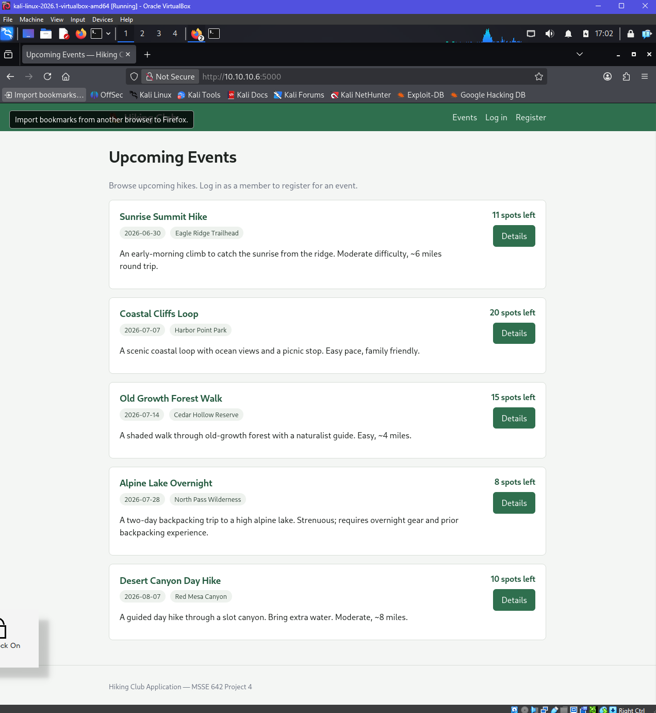
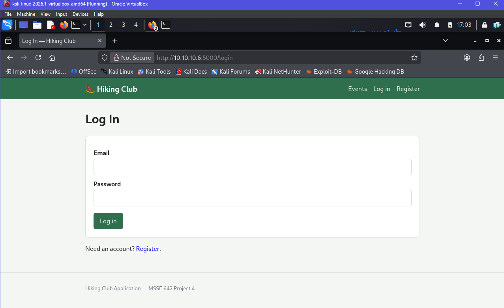
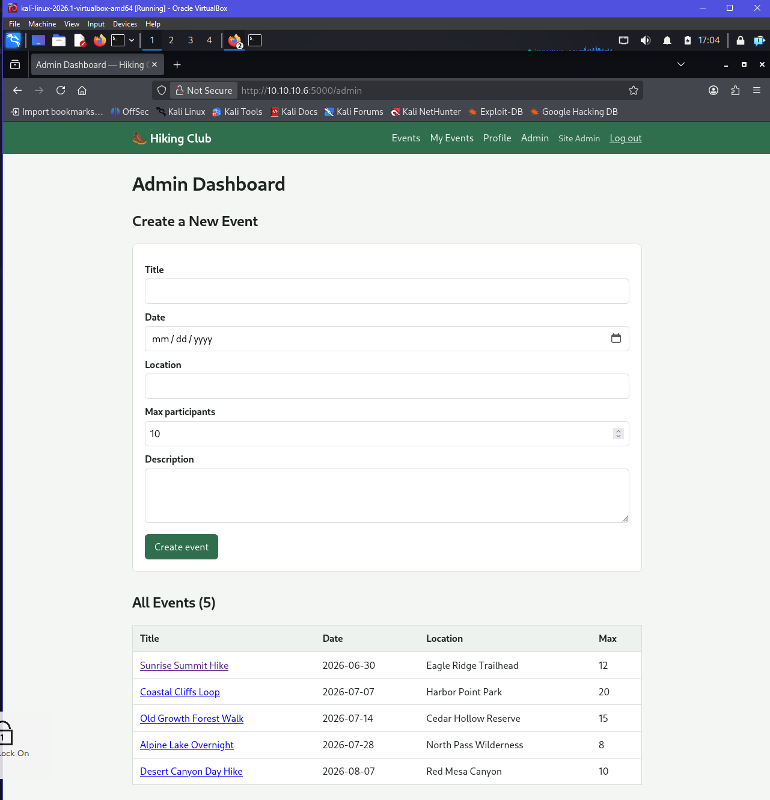
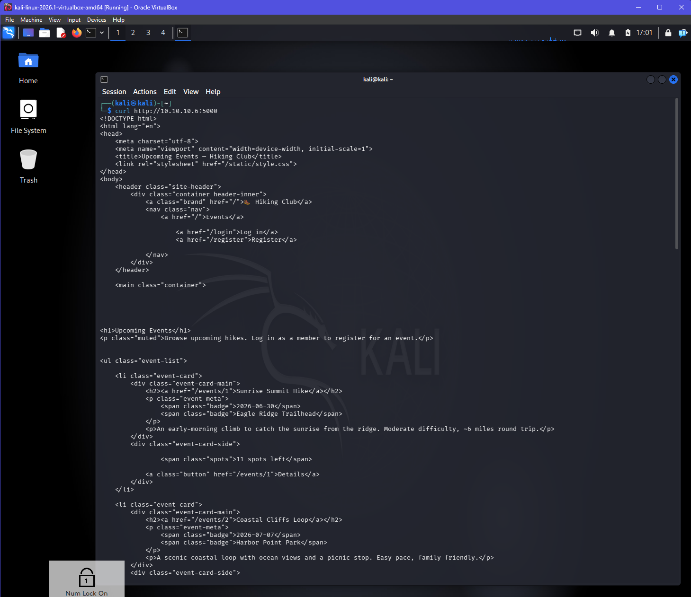
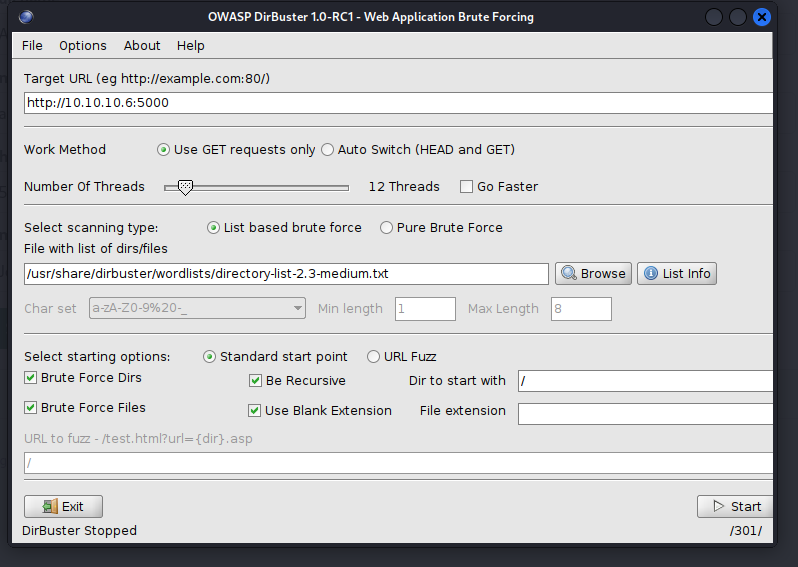

# Project 4 — Penetration Testing, Part 2 (Web Application Deep Dive)

**Course:** MSSE 642
**Application:** Hiking Club Application
**Group members:** Andrew Bazen, Depen Tamang, Anusha Reddy

### References

- Singh, G. (2019). *Learn Kali Linux 2019* (esp. Chapters 14–15). Birmingham, UK: Packt Publishing.
- OWASP Foundation. *OWASP ZAP (Zed Attack Proxy).* <https://www.zaproxy.org/>
- The hiking club application built for this assignment lives in this repo at
  [`code/hiking-club-app/`](../../code/hiking-club-app/), and implements the design
  from our [Project 2 threat model](./project-2-threat-model.md).

---

## Scenario

The Hiking Club was hit by a ransomware attack and, rather than pay, decided to
rebuild their website from scratch. Our consulting company was hired to perform
penetration testing on the new site. The threat model was developed in Project 2;
this document develops the **web-application penetration testing procedure** our
testers will follow, then rebuilds the application, deploys it in our isolated
pen-testing lab, and tests it with OWASP ZAP.

---

## Part 1 — Web Application Penetration Testing Procedure

> **Note:** The Part 1 write-up (phase descriptions, tool selection table, and the
> per-tool analysis) is owned by another team member. The scaffold below is ready
> for that content to be dropped in so the final document is cohesive.

### Summary Table

| Phase | Description | Tool |
|-------|-------------|------|
| Website Penetration Testing: Information Gathering (Ch. 14) | _One-paragraph description of the information-gathering phase for a web app — fingerprinting the server/framework, mapping the site, and discovering hidden content/routes._ | _e.g._ DirBuster |
| Website Penetration Testing: Gaining Access (Ch. 15) | _One-paragraph description of the gaining-access phase — probing the discovered surface for injection, broken authentication/authorization, XSS, CSRF, etc._ | _e.g._ OWASP ZAP |

### Tool Description and Analysis

For each tool selected above, include:

1. **Section header with the tool name**
2. **Link to the vendor website**
3. **Description of what it does** (3 sentences)
4. **Is it included in Kali Linux 2019, or installed manually?**
5. **How we would use it to test the Hiking Club Application** (one paragraph)

_(Teammate to complete.)_

---

## Part 2 — Coding the Application with Agentic Tools

### Agentic tool used

We rebuilt the site with **Claude Code**, an agentic command-line coding tool. We
chose an agentic tool that writes directly to local source files (rather than a
hosted, closed platform) specifically because the assignment requires us to **keep
full control of the code** so we can clone it onto a VM in our pen-testing lab.
Every file the agent produced lives in version control in this repository under
[`code/hiking-club-app/`](../../code/hiking-club-app/), so the exact same code we
tested locally is what we deployed and scanned.

### What we built

A small, server-rendered web application for a community hiking club. It is
deliberately **normal, functional application code** — no intentional
vulnerabilities were planted — so that the OWASP ZAP scan in Part 4 reflects the
real security posture of a from-scratch build.

**Tech stack**

- Python 3 + [Flask](https://flask.palletsprojects.com/) with Jinja2 templates
- SQLite via the standard-library `sqlite3` module
- [Werkzeug](https://werkzeug.palletsprojects.com/) for password hashing
- Plain CSS

**Roles (mapped from the Project 2 threat model)**

| Role | Logged in? | Can do |
|------|------------|--------|
| Guest | No | View the public list of upcoming events. |
| Member | Yes | Register/log in, view & edit **their own** profile, browse and register for events, see "My Events". |
| Admin | Yes | Everything a member can, plus create events and view the member list. |

**Security choices made during the build (traceable to the threat model)**

- Passwords are hashed with Werkzeug — never stored in plaintext.
- **All** SQL uses parameterized (`?`) queries — no string concatenation, which
  closes the SQL-injection risk identified in Project 2.
- Authorization is enforced **server-side** on every protected route via
  `@login_required` / `@admin_required` decorators.
- The profile route keys off the **session user id only** — there is no user id in
  the URL — so one member cannot view or edit another member's profile (IDOR).
- Jinja2 auto-escaping (on by default) protects rendered output from reflected XSS.
- Login returns the **same error** for "no such email" and "wrong password" so the
  form does not reveal which emails are registered.
- The post-login `next` redirect only accepts internal paths (starts with `/`) to
  prevent open-redirect abuse.

### How we coded it / issues we ran into

- **Collapsing the 3-tier design to one host.** The Project 2 architecture diagram
  shows a 3-tier cloud topology (perimeter firewall → public web subnet → internal
  firewall → private DB subnet inside a VPC). For a single-VM lab target we
  intentionally collapsed this onto one host: the separate private-subnet database
  became a local SQLite file in the same Flask process. The network isolation,
  firewalls, and TLS from the diagram are deployment/infrastructure concerns handled
  at the VM/lab level, not in the application code.
- **Dated seed data.** Events are seeded relative to "today" (`date.today()`), so the
  public home page always shows upcoming events no matter when the app is run or
  re-seeded — this avoided an empty home page during testing.
- **First-run bootstrap.** `app.py` auto-creates and seeds `hiking.db` on first run
  if it is missing, so a fresh clone "just works" on the VM without a manual DB step.
- **Dev server caveat.** The app runs on Flask's built-in development server bound to
  `0.0.0.0:5000`. That is appropriate for an isolated lab target but is not a
  production WSGI server — we call this out so it is not mistaken for a hardening gap.

### Verifying the app is running

We exercised every route and confirmed server-side authorization behaves as
designed: protected routes redirect guests to the login page (HTTP 302), a logged-in
**member** is forbidden (HTTP 403) from the admin dashboard, and the **admin**
reaches it (HTTP 200). The screenshots below show the application running, viewed
from the Kali browser against the deployed instance at `http://10.10.10.6:5000`
(the same build covered locally and in the Part 3 deployment).

**Screen Shot 1 — Public home page (upcoming events)**



> Shows the public **Upcoming Events** page listing the five seeded events, each with
> its date, location, and remaining spots, plus the Guest navigation (Events / Log in
> / Register).

**Screen Shot 2 — Login page**



> Shows the `/login` form (email + password). The browser address bar confirms the
> app is being reached at `http://10.10.10.6:5000/login`.

**Screen Shot 3 — Admin dashboard (logged in as admin)**



> Shows the admin-only dashboard reached as `admin@hikingclub.test`: the "Create a
> New Event" form and the "All Events" table. The nav bar now includes the
> admin-only **Admin** link, demonstrating role-based UI.

**Screen Shot 4 — Member view (profile)**


> Shows "My Profile" logged in as the member Alice Walker, with her own contact and
> emergency-contact details. The profile is keyed off the session user id, so a member
> only ever sees their own record.

---

## Part 3 — Deployment on a VM in the Pen-Testing Lab

To stay consistent with our Project 3 lab, we deployed the application on a **new
Ubuntu Server VM in VirtualBox**, attached to the same **host-only network
(`10.10.10.0/24`)** that already hosts our Kali attacker VM. This keeps the target
isolated from the internet while letting Kali reach it directly.

### Target VM details

| Item | Value |
|------|-------|
| Hypervisor | Oracle VirtualBox |
| Guest OS | Ubuntu Server 22.04 LTS |
| Network adapter | Host-only (`vboxnet0`), `10.10.10.0/24` |
| Target IP | `10.10.10.6` |
| App URL | `http://10.10.10.6:5000` |
| Kali attacker | same host-only network (e.g. `10.10.10.5`) |

### Deployment steps

```bash
# --- On the new Ubuntu VM ---

# 1. Update and install the runtime + tooling
sudo apt update
sudo apt install -y python3 python3-venv python3-pip git

# 2. Pull the exact code we built in Part 2
git clone <this-repo-url> regis-msse
cd regis-msse/code/hiking-club-app

# 3. Create an isolated environment and install dependencies
python3 -m venv .venv
source .venv/bin/activate
pip install -r requirements.txt

# 4. Seed a known-good database, then run the app
python3 seed.py          # creates and seeds hiking.db
python3 app.py           # binds to 0.0.0.0:5000

# (Optional) allow the port if a host firewall is enabled
sudo ufw allow 5000/tcp
```

Confirm the host-only adapter address on the VM:

```bash
ip addr show            # note the 10.10.10.x address on the host-only interface
```

Then, **from the Kali VM**, confirm reachability before any testing:

```bash
curl http://10.10.10.6:5000/
```

> **Containerized alternative.** The repo also includes a `Dockerfile`. On a VM with
> Docker installed, the same app can be deployed with
> `docker build -t hiking-club . && docker run --rm -p 5000:5000 hiking-club`. We
> deployed on a bare VM (above) to keep the target environment simple and
> transparent for scanning.

### Problems we ran into / discussion

- **Host-only IP assignment.** The VM has to be on the **host-only** adapter (not
  NAT) for Kali to reach it directly; on NAT the guest is reachable from the host but
  not from a second VM. We confirmed the `10.10.10.x` address with `ip addr` before
  testing.
- **Binding to all interfaces.** The app must bind to `0.0.0.0`, not `127.0.0.1`, or
  it is only reachable from inside the VM. `app.py` already binds to `0.0.0.0:5000`.
- **Dev server prints the NAT address, not the host-only one.** Because the VM has
  two adapters (host-only + NAT), Flask's startup banner reported
  `Running on http://10.0.3.15:5000` — the **NAT** address. That is cosmetic: binding
  to `0.0.0.0` means it is *also* listening on the host-only `10.10.10.6` address, which
  is the one Kali uses for all testing. We confirmed the host-only address with
  `ip addr` and verified reachability with `curl` from Kali.
- **Firewall / port reachability.** If `curl` from Kali hangs, the usual causes are a
  closed host firewall port (`ufw allow 5000/tcp`) or the app not actually listening
  — `ss -tlnp | grep 5000` on the VM confirms it is bound.
- **Single-process dev server.** Flask's dev server is single-threaded, so a heavy
  ZAP active scan can slow it down. We run discovery and scanning **one tool at a
  time** to keep results clean.

**Screen Shot 5 — Target VM running in VirtualBox**


> Shows the VirtualBox Manager with the `hiking-app` Ubuntu VM **Running** (alongside
> the Kali VM). The Network panel confirms the two adapters used: **Adapter 1
> Host-only** (for Kali-to-target traffic) and **Adapter 2 NAT** (for installing
> packages).

**Screen Shot 6 — App serving on the VM**


> Shows the VM terminal running `seed.py` (3 users, 5 events) and then `python3
> app.py`. Flask reports it is serving on `0.0.0.0` (banner shows the NAT address
> `10.0.3.15:5000`; it also listens on the host-only `10.10.10.6` — see the note
> above).

**Screen Shot 7 — Reaching the target from Kali**



> Shows `curl http://10.10.10.6:5000/` run from the Kali VM returning the app's HTML
> home page, confirming the target is reachable across the host-only network before
> any scanning begins.

---

## Part 4 — Penetration Testing

The assignment requires testing with OWASP ZAP; we precede it with a short
**information-gathering** pass using **DirBuster** so the web-app deep dive covers
both phases from Part 1 — content discovery (Ch. 14) and gaining access (Ch. 15).
The full step-by-step commands for both tools are documented in the app's
[README](../../code/hiking-club-app/README.md#penetration-testing-from-kali-dirbuster--owasp-zap).
We run the tools **one at a time** — the single-process Flask dev server skews
results if DirBuster and a ZAP active scan hammer it simultaneously.

### Information gathering — content discovery with DirBuster

DirBuster brute-forces paths from a wordlist to reveal routes that are not linked in
the UI. We pointed it at `http://10.10.10.6:5000` using
`directory-list-2.3-medium.txt`, GET requests only, no file extension (this is a
route-based Flask app, so paths like `/admin` have no extension).

The HTTP status codes are the finding:

| Path | Code | Meaning |
|------|------|---------|
| `/`, `/login`, `/register` | 200 | Public pages. |
| `/admin`, `/profile`, `/my-events` | 302 | Route exists but redirects guests to `/login` — **proof the protected routes exist and authentication is enforced.** |
| `/static/...` | 200 | Static assets (CSS). |
| random words | 404 | No such route. |

The **302s are the key result**: they confirm the access-control boundary from the
Project 2 threat model is working — the routes are present but unreachable without a
session. This recon also tells the gaining-access phase exactly which endpoints to
target with ZAP.

**Screen Shot 8 — DirBuster running against the target**



> **[Screenshot to capture]** DirBuster started with Target URL
> `http://10.10.10.6:5000`, the medium wordlist selected, GET-only, scan in progress.
> Save as `assignments/images/project-4-dirbuster-running.png`.

**Screen Shot 9 — DirBuster results (status codes for discovered paths)**


> **[Screenshot to capture]** The Results (Tree/List) view showing 200s on public
> pages and **302s on `/admin`, `/profile`, `/my-events`**. Save as
> `assignments/images/project-4-dirbuster-results.png`.

### Gaining access — OWASP ZAP

We tested the deployed app from Kali with **OWASP ZAP**, running both an
unauthenticated automated scan and an authenticated scan so the logged-in pages
(`/profile`, `/my-events`, `/admin`) were also exercised.

#### a) Unauthenticated automated scan

1. Launch ZAP on Kali: `zaproxy`.
2. **Quick Start → Automated Scan.**
3. URL to attack: `http://10.10.10.6:5000` → **Attack**.
4. Review the **Alerts** tab; export with **Report → Generate Report**.

#### b) Authenticated scan (covers member/admin pages)

To reach logged-in pages we configured form-based authentication in a ZAP Context:

- **Login Form Target URL:** `http://10.10.10.6:5000/login`
- **Login Request POST Data:** `email=&password=`
- **Logged-in indicator (regex):** `Log out` • **Logged-out indicator:** `Log in`
- Add two Users — the **member** creds and the **admin** creds — then **Spider** and
  **Active Scan** as each user to exercise both roles.

#### ZAP scan results

We ran the active scan with the **Pen Test** scan policy (high strength), which is
more aggressive than the Dev/QA policies and exercises the injection rules fully.
ZAP reported a mix of genuine configuration weaknesses **and two High-severity
injection findings that, on manual verification, turned out to be false positives** —
exactly the kind of result a pen tester must triage rather than report blindly.

| Finding | Severity | Verdict | Notes |
|---------|----------|---------|-------|
| Absence of Anti-CSRF Tokens | Medium | **Confirmed** | The POST forms (login, register, profile, event registration, create-event) have no CSRF tokens. Remediation: add per-form CSRF tokens (e.g. Flask-WTF). |
| CSP header not set + missing anti-clickjacking / X-Content-Type-Options headers | Low/Medium | **Confirmed** | No `Content-Security-Policy`, `X-Frame-Options`, or `X-Content-Type-Options` headers on the dev server. Remediation: add security headers (e.g. via a reverse proxy or Flask-Talisman). |
| Server leaks version information via `Server` header | Low | **Confirmed** | Responses advertise `Server: Werkzeug/3.0.3 Python/3.14.4`, disclosing framework/language versions. Remediation: suppress/override the `Server` header at a reverse proxy. |
| Cookie without `SameSite` attribute | Low | **Confirmed** | The session cookie lacks the `SameSite` (and `Secure`) flag over plain HTTP. Remediation: set the flags and serve over HTTPS. |
| **SQL Injection** (`/register`, param `name`) | High | **False positive** | ZAP's boolean heuristic ( `AND 1=1` vs `AND 1=2` ) saw different responses, but the difference is the app's **duplicate-email check**, not SQL. Manually disproved below. |
| **Path Traversal** | High | **False positive** | Same boolean/response-difference heuristic on a parameter. No route maps user input to a filesystem path — the only file accessed is the SQLite DB, via parameterized queries — so directory traversal is not reachable. |
| Reflected/Stored XSS | — | **Not detected** | Jinja2 auto-escaping; ZAP raised no XSS alert. |

##### Manually verifying the High-severity injection findings

A core part of the Chapter 15 "gaining access" workflow is confirming that an
automated finding is actually exploitable before reporting it. We reproduced ZAP's
test against the same code and showed the SQL Injection alert is a false positive:

1. **Why ZAP's heuristic misfired.** ZAP injects into the `name` parameter on
   `/register` while keeping the email constant. The first request (`…AND 1=1`)
   *creates* the account and returns "Account created"; the second
   (`…AND 1=2`) reuses the now-existing email and returns "An account with that email
   already exists." ZAP interprets that response difference as boolean-based SQLi,
   but it is purely the app's stateful duplicate-email handling.

2. **Real injection payloads fail.** Classic authentication-bypass payloads submitted
   to `/login` are all rejected — none log in:
   - `' OR '1'='1` → *Incorrect email or password*
   - `' OR 1=1 -- ` → *Incorrect email or password*
   - `admin@hikingclub.test' -- ` → *Incorrect email or password*

3. **Payloads are stored as literal data.** Registering with the name
   `Robert'); DROP TABLE users;--` stores that exact string as the user's name and
   the `users` table is untouched — proof the value is bound as a parameter, never
   executed as SQL.

The root cause is the build itself: every query in `db.py` / `app.py` uses `?`
placeholders (parameterized queries), so user input is never concatenated into SQL.
This validates the SQL-injection mitigation from the Project 2 threat model. The
same reasoning retires the Path Traversal finding — the application performs no
user-controlled filesystem access. **Net real findings: the four configuration
issues above (CSRF tokens, security headers, version disclosure, cookie flags).**

**Screen Shot 10 — ZAP spider / site tree of the target**


> Shows the ZAP **Sites** tree after spidering `http://10.10.10.6:5000` — the
> discovered routes (`/admin`, `/events`, `/login`, `/logout`, `/my-events`,
> `/profile`, `/register`, plus the POST endpoints). The response pane shows the
> `Server: Werkzeug/3.0.3 Python/3.14.4` header noted in the findings table.

**Screen Shot 11 — ZAP Alerts tab**


> Shows the **Alerts** tree with the full result set: the two High-severity injection
> alerts (Path Traversal and SQL Injection) that we manually triaged as false
> positives, plus the confirmed configuration findings — Absence of Anti-CSRF Tokens,
> CSP Header Not Set, missing anti-clickjacking and X-Content-Type-Options headers,
> Cookie without SameSite Attribute, and Server version-information leakage.

**Screen Shot 12 — A specific alert in detail (SQL Injection — false positive)**


> Shows the **SQL Injection** alert expanded against `/register` (parameter `name`,
> Risk High, Confidence Medium). ZAP's "Other Info" notes the result was inferred from
> the boolean conditions `AND 1=1` / `AND 1=2` — the heuristic we reproduce and
> disprove in the "Manually verifying" subsection above.

**Screen Shot 13 — Authenticated active scan**


> Shows the **Active Scan** running as an authenticated user — the request pane
> carries a `Cookie: session=…` header (so logged-in pages are reached), and the
> scan progress shows thousands of requests across `/profile`, `/events`, `/admin`,
> and the other authenticated routes.

---

## Conclusion

Starting from the Project 2 threat model, we rebuilt the Hiking Club site from
scratch with an agentic tool that kept the source under our control, deployed it on
an isolated Ubuntu VM in our VirtualBox pen-testing lab, and tested it with OWASP
ZAP from Kali. The Pen Test scan raised two High-severity injection alerts, but
manual verification showed both were false positives — parameterized queries and the
absence of user-controlled filesystem access meant neither SQL injection nor path
traversal was actually exploitable, validating the mitigations from the Project 2
threat model. The genuine findings were configuration gaps a from-scratch dev build
still has (missing CSRF tokens, missing security headers, server-version disclosure,
and cookie flags), each of which maps to a concrete remediation for the client. The
exercise reinforced a key Chapter 15 lesson: an automated scanner's findings are a
starting point, not a verdict — the tester has to confirm exploitability before
reporting.
